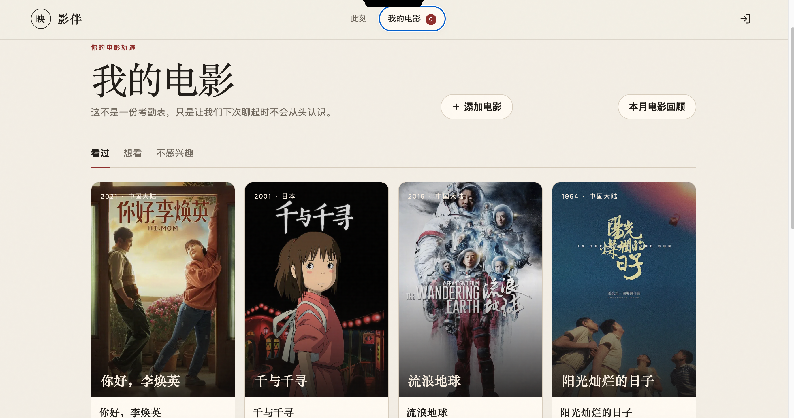

# 影伴 —  AI 电影伙伴

影伴是以电影为入口的长期 AI 观影伙伴。本仓库只保留项目代码和公开使用说明；内部 PRD、阶段交接、设计方案及评测文档不进入 Git。

## 界面预览

### 此刻 · 从一部电影聊起

从“聊聊我看完的电影”或“帮我找一部电影”开始，选择今晚与电影相处的方式。


### 这周，可以从这里开始

当日票房展示区提供电影信息、票房排名和数据来源入口，也可以直接留在想看或聊聊这部电影。


### 我的电影 · 留下观影轨迹

按“看过”“想看”“不感兴趣”整理电影，查看海报片单，并从这里添加电影或进入本月电影回顾。



## 核心能力

当前项目支持以下核心闭环：

- 管理员批量生成邀请码，用户以邀请码长期登录同一账户；
- 用户在“聊电影”和“推荐电影”两个入口间选择；
- 讨论已确认的电影时自动写入看过列表；
- 推荐工具在数据层硬性排除看过的电影；
- 用户可以查看、搜索、添加和删除自己的电影状态；
- 阿映保持角色型交流，同时在被询问时如实说明 AI 身份；
- 用户的现实烦恼不会进入长期观影记忆；
- 管理员可以在网页中配置 Anthropic 或 OpenAI 兼容模型并测试连接；
- “聊电影”和“找电影”使用两套可独立编辑、可恢复默认的系统提示词；
- 管理员可以分别设置未选电影、已选电影和推荐模式的三套聊天开场白，已选电影开场白支持 `{movie}` 片名占位符；
- 无模型密钥时使用演示 Agent，有密钥时启用真实工具调用循环。
- 本地片库未命中时可通过 TMDB 自动补全新电影；旧片缺少海报时也会按片名和年份惰性补图并写回片库，推荐卡片和片单中的图片加载失败会降级为稳定的文字封面；
- Agent 可按全网、豆瓣或知乎范围检索公开资料，并受限读取公开的豆瓣/知乎页面；
- 用户可以按住说话，转写后发送；AI 回复保留文字，并提供“波形＋时长”语音胶囊；语音默认尝试自动播放，用户可通过聊天页开关关闭。
- 新账户必须先选择 5 部真实看过的电影，并分别标记“喜欢 / 一般 / 不喜欢”；负向评价与 `watched` 事实严格分离；
- 完成冷启动后生成带电影证据、可查看、可修正和有版本号的口味画像；画像只描述电影偏好，不推断人格、心理、医疗或现实身份；
- 每张推荐卡返回账户隔离的 `impression_id`，支持想看、已看、讨论、暂时不看、氛围不符、类型不符、太沉重和持续不感兴趣等反馈；
- 观后感改为用户可控版本：AI 只生成草稿，用户可以确认、编辑成新版本、重新整理、锁定、解锁或只删除观后感而保留看过状态；
- 产品事件与模型用量事件只保存非敏感结构化属性；管理端“产品健康概览”只显示漏斗、反馈、状态、延迟、错误和估算成本汇总。
- 每次普通进入“聊电影”都会创建一段空白新对话；确认电影后的历史对话按《片名》列在“历史对话”中，仅在当前浏览器保留 7 天，只有用户显式打开历史记录才会恢复。用户可逐条删除或全部清空；只有明确选择“下次继续聊”时，服务端才保存与具体电影绑定的讨论摘要，摘要与观后感可独立删除。
- 首页提供每自然周一份克制的电影建议，优先使用想看列表并继续硬排除已看；用户可换方向、关闭本周建议或永久停用，显式刷新每账户每小时最多 3 次。
- 想看列表支持“还想看 / 已经看了 / 暂时不看 / 不再感兴趣”，其中暂时不看不会建立长期排除。
- 用户可显式生成、确认月度电影回顾，并从已确认观后感、已确认回顾或可见口味维度创建带预览、7–30 天过期和即时撤回能力的随机分享链接；月度回顾分享会保存完整电影快照，生成后自动跳转到带全部封面、片单、真实主题、观后感数量、下月方向和数据约束故事文案的可观看 HTML 电影月刊。
- 语音摘要、完整朗读、观后感整理和缺失海报补全进入账户隔离的可观测后台任务；任务有稳定 ID、两次自动尝试、过期状态和不含正文的引用负载，文字主回复不等待这些任务。
- “我的电影”使用稳定分页、总数和加载更多；缺失海报不再阻塞历史接口。

## 一条命令启动

要求 Python 3.11+。代码骨架仅使用 Python 标准库，无需安装依赖。

```sh
cd products/yingban
cp .env.example .env

# 首次生成登录邀请码；完整邀请码只显示这一次
python3 app.py generate-invites 1

# 启动用户端和管理后台
python3 app.py serve
```

打开：

- 用户端：<http://127.0.0.1:8765>
- 管理后台：<http://127.0.0.1:8765/admin>

不要直接双击 `web/index.html`。影伴依赖本地 HTTP 服务提供样式、脚本、登录和 API；若误用 `file://` 打开，页面会自动跳转到默认服务入口 `http://127.0.0.1:8765/`。

管理员后台使用 `.env` 中的 `YINGBAN_ADMIN_TOKEN` 登录。

## 演示模式与真实模型

没有模型密钥时，系统使用内置演示 Agent。邀请码、冷启动、口味画像、观影记录、推荐去重、推荐反馈、观后感版本控制和全部页面仍会真实工作；演示模式不会伪造 AI 观后感草稿。

登录管理后台后，在“模型与 Agent”区域可以：

1. 选择 Anthropic Messages 或 OpenAI 兼容协议；
2. 配置模型名称、接口根地址、API 密钥、请求超时、最大输出长度和表达温度；
3. 在保存前测试连接，保存后无需重启即可生效；
4. 分别编辑“聊电影 Agent”和“找电影 Agent”的完整系统提示词；
5. 分别设置未选电影、已选电影和推荐模式的聊天开场白；
6. 将提示词或开场白恢复为产品默认版本。

“产品健康”区域只展示非敏感汇总，并允许按版本配置模型每百万输入/输出单位价格和第三方单次调用价格。价格以人民币记录，保存后只作用于后续调用事件；未配置时使用 `unpriced-v1 / ¥0`，表示尚未定价而不是调用免费。

`.env` 中的模型配置仍可作为首次启动时的默认值：

```env
ANTHROPIC_API_KEY=your-key
MODEL_ID=claude-sonnet-4-6
ANTHROPIC_BASE_URL=https://api.anthropic.com
```

管理员第一次在页面中保存后，以数据库中的配置为准。API 密钥保存在本机 SQLite 数据库中，数据库文件权限会收紧为仅当前系统用户可读写；管理接口只返回密钥末四位掩码，不返回完整密钥。公开部署时应改用专用密钥服务。

## 联网电影、豆瓣/知乎与海报

管理后台“联网与影片”区域提供三项能力：

1. TMDB：搜索本地种子片库之外的新电影、补充推荐候选并返回海报；
2. Tavily Search（默认）：提供全网检索，并通过域名限定检索豆瓣和知乎公开结果；免费 Researcher 方案目前每月提供 1,000 credits、无需绑定信用卡，影伴固定使用每次 1 credit 的 `basic` 搜索；已有 Brave Search 配置仍可在后台切换并继续使用；
3. 公开页面阅读器：只允许读取公开的豆瓣和知乎页面，不使用 Cookie，不自动登录、不绕过验证码或其他访问控制。

TMDB 和 Web Search 密钥可以只在管理后台填写；`.env` 变量仅作为首次启动默认值。Tavily 密钥可在 [Tavily Platform](https://app.tavily.com) 免费注册后复制，官方额度说明见 [Credits & Pricing](https://docs.tavily.com/documentation/api-credits)。联网服务不可用时，种子片库、观影历史和演示推荐继续工作。外部电影会以 `tmdb-{id}` 形式持久化到 `movies` 表，后续仍受“看过电影硬排除”约束。

## 语音交互

管理后台“语音交互”区域默认使用豆包语音，也保留 OpenAI 兼容接口。豆包默认组合为：

- 录音文件极速识别：`volc.bigasr.auc_turbo`
- 语音合成模型 2.0：`seed-tts-2.0`
- 暖声女声音色：`zh_female_xiaohe_uranus_bigtts`
- 接口根地址：`https://openspeech.bytedance.com`

豆包新版控制台只需填写 App Key；旧版控制台可以展开填写 App ID 和 Access Token。密钥只经过影伴后端，不写入浏览器源码。OpenAI 兼容模式继续调用 `/v1/audio/transcriptions` 和 `/v1/audio/speech`。

用户聊天输入框始终显示语音切换按钮。未配置时会明确提示管理员填写豆包凭据，不再把功能入口直接隐藏；配置生效后的流程为：

1. 按住“按住说话”开始录音，松开发送，`Esc` 取消；
2. 浏览器把当次录音交给后端转写，文字作为真实用户消息进入原聊天链路；
3. AI 先显示文字回复，再在“阿映”名称下方提供与酒红主题一致的“波形＋时长”语音胶囊，可播放、暂停和重播；
4. “自动播放”开关默认开启并按浏览器持久保存；浏览器允许时会在音频生成后立即播放，若有声自动播放被浏览器策略拦截，则保留可点击胶囊供用户手动播放；
5. 后端不把原始录音或合成音频写入长期数据库。

AI 推荐正文中的电影海报由结构化电影卡片展示。服务端会清理模型偶发返回的 `[海报](...)`、TMDB 图片地址和多余 Markdown 强调标记，避免把技术链接显示给用户或交给语音朗读。

Chrome 等浏览器通常产生 WebM/Opus 录音。豆包文件识别主要接受 WAV、MP3 和 Ogg/Opus，因此后端会在需要时通过 `ffmpeg` 的标准输入/输出管道转换为单声道 16 kHz WAV，全程不写临时音频文件。部署环境必须提供 `ffmpeg`，否则不受豆包支持的浏览器录音格式会得到明确错误。

模型循环最多运行 8 个工具轮次，当前提供 7 个领域工具：

1. `search_movie`
2. `get_movie_detail`
3. `list_watched_movies`
4. `mark_movie_watched`
5. `recommend_movies`
6. `search_web`
7. `read_public_page`

## 邀请码行为

邀请码同时是注册与登录凭证：

1. 第一次使用时自动创建账户并绑定；
2. 以后使用同一码进入同一账户；
3. 停用后，邀请码和该账户现有会话立即失效；
4. 换发后，新邀请码进入原账户，观影历史保留，旧邀请码失效。

命令行可以批量生成和查看状态：

```sh
python3 app.py generate-invites 10
python3 app.py list-invites
```

完整邀请码只在生成或换发当次展示。数据库只保存加密摘要和末尾识别字符。

## 数据与隐私边界

SQLite 数据库默认位于 `data/yingban.db`，不会被 Git 跟踪。长期数据包括：

- 账户与邀请码绑定；
- 看过、想看和不感兴趣的电影状态；
- 推荐曝光记录；
- 冷启动进度、5 部电影的正向/中性/负向反馈和带电影证据的口味画像；
- 与具体推荐曝光关联的反馈动作；
- 每部已看电影的版本化观后感；它只整理与该电影直接相关的感受、理解、困惑、主题和人物关注点，不保存现实烦恼、身份、家庭、工作、学校、联系方式、心理或医疗等敏感经历；
- 用户明确授权保存的电影会话摘要；它只保存讨论进度、电影主题、未完问题和剧透许可，不保存聊天原文，并可与观后感分别删除；
- 每周建议、月度回顾、分享卡的随机令牌与过期/撤回状态，以及语音、观后感和海报后台任务的引用、状态和错误类别；
- 不含原始聊天、观后感正文、录音、密钥、邀请码和会话令牌的 `product_events` 与 `model_usage_events`；
- 不包含原始聊天文本的安全事件。
- 管理员配置的模型参数、模型密钥、两套 Agent 系统提示词、三套聊天开场白和带版本的调用成本价格表。

当前电影聊天通过版本化 `localConversationStore` 适配层仅保留在当前浏览器，默认 7 天后自动过期。普通进入“聊电影”总是创建新 ID 和空白上下文，不会静默续接旧聊天；只有从“历史对话”列表点击某个按《片名》命名的记录时才恢复。历史记录按账户提示隔离，最多保存最近 40 条本机会话消息和 6000 字符未发送输入，可逐条删除、全部清空，退出登录时可选择保留或清空。旧版 `yingban.chatDraft.v1.*` 会一次性迁移到 `yingban.conversation.v2.*`；这层边界允许未来替换成云端同步适配器，但当前没有上传原始聊天。每轮请求仍只回传当前会话所需历史，后端不把聊天正文写入长期数据库。只有用户显式选择“下次继续聊”时，才预览并保存不含原始消息的 `conversation_summaries`。用户显式点击整理，或开启自动草稿并离开达到有效阈值的电影讨论时，模型只把与已确认电影直接相关的内容生成到 `movie_reflections.status='draft'`。用户确认或编辑后才更新兼容快照 `user_movie_states.note`；锁定版本不能被 AI 静默覆盖。观影历史、口味画像、用户保留的观后感和明确授权的电影会话摘要继续存在。

分享页使用 `/share?token=...` 的随机不可枚举令牌。公开响应不含 `account_id` 和令牌本身，页面声明 `noindex/nofollow/noarchive`；分享默认 7 天、最长 30 天，到期或用户撤回后立即不可访问。分享正文必须来自已确认/锁定观后感、已确认月度回顾或当前可见口味维度，并统一标注“由影伴 AI 协助整理”。月度回顾的 `content.visual` 是创建时固化的公开安全快照，只含月份、电影标题/年份/类型/封面、确认观后感数量、电影主题、用户填写的下月方向和由这些字段确定性整理的本月故事，不含账户信息、聊天原文或未确认草稿。

## 电影目录

`data/movies.json` 是离线兜底用的中外热门种子片库。配置 TMDB 后，新电影在首次搜索或推荐发现时自动进入 SQLite 电影目录，无需手工修改种子文件。生产化前仍需要：

- 选择合规且稳定的电影数据源；
- 建立标题、原名、译名和版本的统一 ID；
- 补充可验证的内容提醒和数据更新时间；
- 在管理员后台增加影片目录管理能力。

## 测试

```sh
python3 -m unittest discover -s tests -v
```

测试覆盖普通进入生成新会话、历史恢复必须显式触发、历史按电影命名、旧版草稿迁移、本机消息数量限制，以及历史列表和删除确认入口。

观后感整理接受“还好”“还行”“一般”“没感觉”等简短但明确的电影评价，不再统一要求 12 个字符。整理器从最长 24 条上下文中同时保留前 12 条和后 12 条，避免对话后来转到其他电影时丢失早期目标电影反馈；`role=assistant` 只帮助理解问答关系，不能成为观后感证据。内容少时允许忠实的 20 字以上短笔记，不为凑到 80 字而扩写。

## 目录

```text
products/yingban/
  app.py                 # CLI 与启动入口
  server.py              # Web API、认证、安全边界和静态资源服务
  agent.py               # 双 Agent 提示词、双协议模型客户端、Agent Loop 和七个领域工具
  integrations.py        # TMDB、Tavily/Brave Web Search 与受限公开页面阅读器
  voice.py               # OpenAI 兼容语音识别与合成
  catalog.py             # 影片识别、检索、筛选与硬性去重
  storage.py             # SQLite、邀请码、画像、连续性、回顾、分享、后台任务、事件与 Agent 配置
  settings.py            # .env 配置
  data/movies.json       # 可替换的热门电影种子目录
  web/                   # 用户端、公共分享页与管理员后台
  tests/                 # 核心闭环测试
```

## 生产部署提示

公开部署前应配置 HTTPS、专用密钥服务、持久化数据库、备份、审计、限流和安全评测；不要直接提交 `.env`、数据库或真实凭据。
