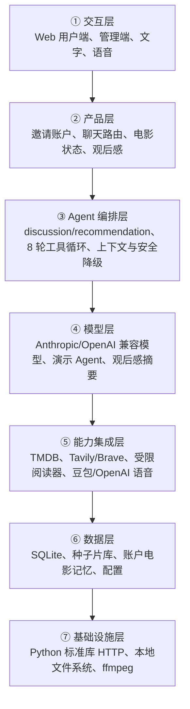

# 影伴产品开发总文档

> 文档性质：产品与工程的长期权威总纲。  
> 文档版本：`1.3`
> 建立日期：`2026-08-21`  
> 当前代码基线：第十一阶段完成状态。
> 下一技术开发阶段：第十二阶段。
> 适用目录：`products/yingban/`。

## 0. AI 快速接手卡

- 产品名称：影伴。
- 产品定位：邀请制 AI 电影伙伴，帮助用户在看前获得不重复的个性化推荐，在看后进行电影讨论，并把与电影直接相关的感受整理成用户可回看的观后感。
- 当前完成阶段：第十一阶段。
- 当前权威代码目录：`products/yingban/`。
- 启动入口：在权威代码目录执行 `python3 app.py serve`。
- 用户端：`http://127.0.0.1:8765/`。
- 管理端：`http://127.0.0.1:8765/admin`。
- 自动化测试：`python3 -m unittest discover -s tests -v`。
- 当前测试基线：50 项；这是 2026-08-22 的时点状态，开发前必须重新执行。
- 当前页面：邀请码登录、5 部电影冷启动、可解释口味画像、此刻首页、本周电影建议、每次普通进入都新建的电影讨论、本机历史对话列表与显式恢复、电影会话摘要、电影推荐与原因反馈、分页“我的电影”、想看跟进、月度回顾、版本化观后感、普通分享预览、生成后自动跳转的月度 HTML 电影月刊、连续性设置、管理员配置中心与产品健康概览。
- 当前 Agent：`discussion` 与 `recommendation` 两套独立提示词，共用受限领域工具和账户级观影记忆。
- 当前长期数据：账户、邀请码、会话摘要令牌、电影目录、用户电影状态、冷启动反馈、可解释口味画像、推荐曝光与反馈、版本化观后感、用户明确授权的电影会话摘要、周建议、月度回顾、分享卡状态、引用型后台任务、非敏感产品事件、模型/第三方用量事件、不含原话的安全事件和应用配置。
- 当前不长期保存：原始聊天正文、浏览器本机历史对话、原始录音、合成音频、用户的现实烦恼和敏感经历；本机历史只在当前浏览器保留 7 天，音频只在进程内短时缓存 10 分钟。
- 已实现的冷启动产品决策：新用户使用 5 部电影建立初始口味基线；默认文案为“喜欢 / 一般 / 不喜欢”，不提供跳过，自动整理默认开启但只产生草稿。
- 已确认的商业决策：当前三个开发阶段不开发商业化；产品上线并获得真实市场反馈后，再单独立项评估。
- 当前路线：第九阶段“冷启动、反馈与信任”、第十阶段“留存、连续性与主动服务”和插入的第十一阶段“本机历史对话与新会话语义”已完成；原定 P2“共同观影与上线就绪”顺延为第十二阶段候选。
- 不可破坏的约束：推荐在数据层硬排除已看电影；AI 身份透明；账户数据严格隔离；用户手工内容不得被 AI 静默覆盖；不保存原始聊天与音频；涉及敏感内容时安全降级优先于电影任务；密钥不得返回浏览器。
- 第十阶段确认项：本机聊天草稿保留 7 天并保留未来替换为云端保存适配器的可能；本周建议首先出现在首页，同时在卡片和“连续性与主动建议设置”中提供本周关闭或永久停用。
- 第十一阶段确认项：每次普通进入“聊电影”都是新对话；以前的电影聊天通过“历史对话”按《片名》查找，只有显式打开才恢复；记录仍只在当前浏览器保存 7 天。
- 已知阻塞：正式成本仍需管理员依据供应商账单填写价格表；第十二阶段开始前需确认小组人数/过期、正式登录和生产部署方案。
- 接手顺序：根目录 `AGENTS.md` → 本总文档 → `第十一阶段技术开发文档.md` → 当前代码和测试 → 需要追溯时再读更早阶段文档。

## 1. 本文档的职责

### 1.1 为什么需要总文档

阶段技术开发文档擅长记录某次交付结束时的真实状态，但它不应单独承担长期产品方向、需求优先级、未来架构和开发治理规则。本文档的意义是提供一个持续维护的项目总纲，防止以下混乱：

1. 同一个概念在不同阶段被赋予不同定义。
2. 新功能只修页面，却没有同步修改数据、接口、Agent 和测试。
3. 用户明确确认的决策在后续迭代中被无意替换。
4. 为了开发一个局部功能，破坏已有隐私、记忆、推荐去重或账户隔离约束。
5. 未经市场验证就开发商业化、公共社交或高成本功能。
6. 把历史文档的时点状态误当作永远不变的当前事实。

### 1.2 权威顺序

当信息冲突时，按以下顺序处理：

1. 用户在当前对话中明确确认的最新决策。
2. 经只读检查、测试和真实运行确认的当前代码行为。
3. 本总文档中标记为“已确认”的长期决策和契约。
4. 最新阶段技术开发文档。
5. 早期阶段技术开发文档、README 和历史设计说明。

如果当前代码与本文档冲突，不能直接选择其中一方。必须先用只读检查确认真实行为，再在新阶段文档中记录差异、原因和处理决策，同时更新本文档中已经过时的部分。

### 1.3 信息状态标记

本文档使用以下状态，开发者不得混用：

- **已实现**：当前代码已存在，并在最新阶段通过相应验证。
- **已确认**：用户或项目规则已明确决定，后续不得擅自更改。
- **阶段基线**：某一未来阶段默认按此方案实施，如开发前发现明显冲突，需请用户决策。
- **待确认**：当前没有足够信息，不得通过代码暗自做决策。
- **延后**：有价值，但明确不进入当前三阶段。
- **禁止**：与产品原则、隐私、安全或已确认边界冲突，不得实施。

### 1.4 总文档与阶段文档的关系

- 本文档记录长期定义、未来三阶段路线和开发治理。
- `第X阶段技术开发文档.md` 记录某次实际交付的代码快照。
- 一个未来产品阶段应与一份新的技术阶段文档对应。当前映射为 P0=第九阶段、P1=第十阶段；用户插入的本机历史迭代=第十一阶段；P2 顺延为第十二阶段候选。
- 如某阶段范围太大必须拆分，必须先获得用户确认，再修改本文档的阶段对应关系，不得在开发中途静默扩大或缩小交付范围。

## 2. 已确认产品决策

### 2.1 产品核心定位

**已确认的产品主体**：影伴是个人 AI 电影伙伴，不是电影百科、电影资讯站、公共影评社区或泛化情感陪伴产品。

该定义的意义是：

1. 电影是所有交互的必要锚点。
2. 产品可以从用户当下心情理解观影需求，但不将自己宣称为心理咨询、医疗、真人友谊或亲密关系替代品。
3. 产品长期价值来自用户逐步沉淀的电影轨迹、电影口味和用户自主确认的观后感，不来自单次聊天的新鲜感。
4. 用户可以从“想看什么”或“看完想说什么”两个入口进入，两个入口最终都回到个人电影记忆。

### 2.2 核心价值闭环

影伴的完整闭环定义为：

1. **建立基线**：新用户通过 5 部已看电影建立初始口味基线。
2. **看前理解**：用户表达口味、心情、排除条件或当下需求。
3. **不重复推荐**：系统从真实电影候选中推荐，在数据层排除用户已看的电影。
4. **用户表态**：用户对推荐做出想看、已看、不感兴趣、暂时不合适或继续讨论等可解释反馈。
5. **看后讨论**：用户围绕已确认的电影谈感受、人物、主题、困惑和余味，并自主决定是否允许剧透。
6. **形成记忆**：AI 只把与该电影直接相关的内容整理为草稿，用户可确认、编辑、锁定或删除。
7. **越来越懂用户**：后续推荐和讨论使用用户可见、可修改、有电影证据的口味画像，而不是不透明的人格推断。

### 2.3 冷启动数量

**已确认**：产品冷启动先定 5 部电影，不使用 10 部。

“5 部电影”的意义是降低首次使用门槛，同时提供比单部电影更稳定的初始口味证据。数量 5 是当前确认的产品契约，后续不得因为页面排版或开发方便擅自改成其他数量。

### 2.4 商业化状态

**已确认**：当前不做商业化，等产品上线后根据市场反应再决定。

因此，第九、第十、第十一和第十二阶段明确不包含：

- 会员等级、订阅周期和付费限额。
- 微信、支付宝、App Store 或其他支付接入。
- 付费墙、聊天次数包、金币、积分、抽卡或虚拟道具。
- 广告系统、影片付费置顶、片方暗中干预自然推荐。
- B2B 销售后台、机构账户计费和商务合同流程。
- 在没有真实上线数据前写入固定价格或收入预测。

本文档只保留“上线后商业化评估门槛”，用于说明什么时候可以开始一个新立项。该评估门槛不等于已授权开发付费功能。

## 3. 用户、问题与产品目标

### 3.1 核心用户假设

**阶段基线，需通过真实上线验证**：

核心用户是会持续看电影，但不一定愿意发布公开长影评的人。他们的典型需求是：

1. 看完一部电影后有感受，但不知道如何组织成文字。
2. 希望有人能认真接住电影感受，但不想进入公共评论区。
3. 在不同心情和情境下需要推荐，不只想看排行榜或同类热门片。
4. 反感被反复推荐已看过的电影。
5. 希望几个月或几年后回看自己与电影的关系，而不是只保留一个片名列表。

### 3.2 不应被当作核心用户的人群

- 只需要查票房、演员表、上映日期等快速百科信息的用户。
- 主要需求是公开发布影评、涨粉或参与大规模评分社区的用户。
- 期待 AI 扮演真人伴侣、恋人、亲属或心理医生的用户。
- 把电影推荐当作医疗、危机干预或重大人生决策工具的用户。

### 3.3 核心用户任务

| 任务 | 用户真实需要 | 产品交付 | 成功含义 |
|---|---|---|---|
| 快速让影伴认识自己 | 不填写抽象性格问卷 | 选择 5 部看过的电影并给出轻量反馈 | 用户能在短时间内完成，首次推荐能解释与 5 部电影的关系 |
| 找下一部电影 | 被理解当下情境，而非只按类型过滤 | 1–3 部真实候选、匹配理由、内容提醒和反馈操作 | 用户能明确选择想看、换方向或继续问 |
| 说清楚看后感受 | 被接住，不被迫写影评 | 有剧透控制的电影讨论 | 对话围绕已确认电影，AI 不伪造自身真实经历 |
| 留下观后感 | 不想每次从空白文档开始 | AI 观后感草稿、用户确认和编辑权 | 用户知道保存了什么，可修改和删除，不被静默覆盖 |
| 回看个人电影轨迹 | 看见自己与电影的关系 | 看过、想看、不感兴趣、观后感与口味变化 | 所有数据属于当前账户，可查看、修正、导出和删除 |

### 3.4 产品目标

未来三阶段的产品目标不是单纯增加功能数量，而是依次证明：

1. 用户可以低成本完成首次建档，并立刻获得与 5 部电影有关的个性化价值。
2. 用户愿意通过推荐反馈和观后感确认来修正影伴的理解。
3. 用户在首次使用后会回来，而不是只进行一次 AI 聊天。
4. 产品能在不牺牲隐私和可控性的前提下形成有用的长期电影记忆。
5. 产品在上线前具备账户、数据、安全、合规、部署、监控和故障恢复的基本生产能力。

## 4. 产品原则与禁止项

### 4.1 产品原则

1. **先电影，后延伸**：可以谈心情，但必须回到电影选择或电影感受。
2. **记忆可见**：任何长期记忆都应有用户可见的产品表达，不建立用户无法查看的隐形人格档案。
3. **记忆可改**：用户能修正电影状态、口味反馈和观后感。
4. **记忆可删**：用户可以删除某一份观后感而保留已看事实，也可删除整个电影状态。
5. **推荐可解释**：匹配理由应基于用户当下请求、已确认口味或电影证据，不使用虚构的心理诊断。
6. **状态和评价分离**：“看过”是观看事实，“不喜欢”是观看后反馈，“不感兴趣”是当下推荐排除。三者不得用同一字段含混表达。
7. **主回复优先**：观后感、语音、联网和海报失败不应导致主聊天无法返回。
8. **成本可观测**：所有模型、搜索、语音调用必须可区分场景、延迟和成本，但不记录原始私密正文。
9. **内容与商业独立**：未来即使评估商业化，自然推荐排序也不得被未标识商业利益改变。
10. **AI 身份透明**：“阿映”是产品角色，但必须在界面和被询问时明确说明自己是 AI。

### 4.2 禁止项

- 禁止仅依赖提示词排除已看电影，必须保留数据层硬去重。
- 禁止 AI 自动覆盖用户手工编辑或已锁定的观后感。
- 禁止把现实烦恼、身份、家庭、工作、学校、联系方式、心理或医疗内容自动收录到观后感或口味画像。
- 禁止长期保存原始录音和合成音频。
- 禁止模型或第三方 API 密钥返回前端、日志或文档。
- 禁止自动登录、带 Cookie 抓取、绕过验证码或访问非公开豆瓣、知乎内容。
- 禁止把阿映设计成真人亲密关系替代品，禁止过度迎合、情感操纵、诱导依赖或阻碍用户退出。
- 禁止在本三阶段中顺带开发付费、广告、金币或机构计费。
- 禁止未经用户确认就建立公共影评广场或默认公开用户内容。

## 5. 当前产品权威状态

### 5.1 当前用户交互

**已实现**：

1. 用户用邀请码登录；邀请码首次使用创建账户，后续回到同一账户。
2. 空白账户首次登录必须完成 5 部真实看过电影的冷启动；每部使用 `positive`/`neutral`/`negative` 反馈，并始终保留 `watched` 事实。
3. 冷启动完成后生成带电影证据、版本和用户修正入口的口味画像；画像是电影偏好摘要，不是人格、心理、医疗、家庭或现实身份档案。
4. 首页提供“刚刚散场”和“下一部电影”两个入口，并提供“阿映目前怎么理解我”的口味画像入口。
5. 讨论模式可识别电影，遇到同名或多个候选时请用户选择。
6. 讨论模式支持剧透开关，确认电影后自动加入看过。
7. 推荐模式返回结构化电影卡片，包含海报、基本信息、匹配理由、内容提醒和账户隔离的 `impression_id`。
8. 推荐卡片保留“想看”、“看过了，换一部”和“聊聊这部”，并增加 `not_now`、`wrong_tone`、`wrong_genre`、`too_heavy`、`not_interested` 原因反馈；反馈明确只影响电影推荐。
9. “我的电影”包含看过、想看和不感兴趣三个状态页签。
10. 用户可搜索电影并手动加入状态，也可删除账户的某部电影状态。
11. 观后感不再由每轮聊天直接覆盖；显式整理或离开有效电影讨论只生成 `draft`，用户可确认、编辑为新版本、重新整理、锁定、解锁或只删除观后感。
12. “看过”列表中可点击海报查看版本、来源、状态和更新时间，并从弹窗继续聊该片。
13. 文字聊天与语音输入共用同一聊天链路；AI 主回复始终保留文字。
14. AI 语音胶囊支持播放、暂停、重播和浏览器级自动播放偏好。
15. 聊天开场白分为未选电影讨论、已选电影讨论和电影推荐三种场景，管理员可配置。
16. 当前浏览器以版本化 `localConversationStore` 保存电影聊天 7 天；每次普通进入“聊电影”创建新会话，只有用户从“历史对话”按《电影名》显式选择记录才恢复。记录按账户提示和会话 ID 隔离，可逐条删除、全部清空，退出时可选择保留或清空；该适配边界允许未来替换为云端同步，但当前不上传。
17. 用户明确点击“下次继续聊”后，可预览并保存只含电影讨论进度、主题、未完问题和剧透许可的服务端电影会话摘要；摘要与观后感是不同数据，可分别更新或删除。
18. 首页显示本周电影建议；每自然周默认自动生成一次，优先使用想看列表、继续硬排除已看，用户可提供当周方向、关闭本周卡片或永久停用。显式“换个方向”每账户每小时最多 3 次。
19. 想看列表提供还想看、已经看了、暂时不看和不再感兴趣四种跟进动作；`not_now` 只移出当前想看，不建立长期排除。
20. “我的电影”按稳定游标分页并返回总数；缺失海报进入后台任务，不再阻塞历史列表响应。
21. 用户可显式生成当月电影回顾，回顾只引用当月真实电影状态和 `confirmed/locked` 观后感；用户确认后可填写下月观影方向。
22. 用户可从已确认/锁定观后感、已确认月度回顾或当前可见口味维度创建分享卡；创建前可编辑预览，链接随机、1–30 天过期、可撤回，公开响应不含账户信息并标注 AI 协助整理。
23. 语音默认生成约 15–30 秒摘要，完整朗读为次级操作；语音、观后感和海报任务有账户隔离的稳定任务 ID、状态、最多两次自动尝试和过期状态，主聊天文字不等待任务。

### 5.2 当前管理交互

**已实现**：

- 管理员使用 `YINGBAN_ADMIN_TOKEN` 登录管理页。
- 管理模型 provider、model ID、base URL、API key、超时、最大输出和温度。
- 测试模型连接。
- 独立编辑讨论与推荐系统提示词，并恢复默认。
- 编辑三种开场白，并恢复默认。
- 配置和测试 TMDB、Tavily/Brave 搜索和受限公开页面阅读器。
- 配置和测试豆包语音或 OpenAI 兼容语音。
- 生成、查看提示、停用和换发邀请码。
- 查看不含用户原始内容的账户、冷启动、推荐反馈、观后感状态和模型/第三方调用健康汇总。
- 查看电影会话摘要、周建议、月度回顾、后台任务和分享卡的非敏感状态数量。
- 配置成本价格版本、模型每百万输入/输出单位价格和第三方单次调用价格；价格只作用于后续调用事件。
- 所有第三方密钥在公共管理接口中只返回配置状态和末四位提示。

### 5.3 当前运行模式

- 无模型密钥时，运行演示 Agent。演示模式下账户、状态、推荐硬去重等数据行为继续工作，但不伪造观后感。
- 有模型密钥时，运行真实模型和最多 8 轮工具调用。
- 第十阶段完成时只读配置仍为真实模型模式，模型标识 `deepseek-v4-flash`。第十阶段真实浏览器验收使用独立临时数据库和演示模式，避免向外部模型或主数据库写入验收内容。接手时必须通过 `/api/health` 和只读配置状态重新验证，不得将该时点记录当作永久事实。
- 当前标准库 `ThreadingHTTPServer` 和 SQLite 部署只适合本地或受控环境，不是公网生产架构。

### 5.4 当前时点数据

2026-08-22 通过 SQLite 只读查询看到：

- 2 个账户。
- 60 部电影目录记录。
- 8 条用户电影状态。
- 1 条旧 `note`，已幂等迁移为 1 条 `movie_reflections.version=1,status='confirmed'`。
- 21 条推荐曝光。
- 1 条账户画像、5 条电影反馈、0 条推荐反馈。
- 33 条非敏感产品事件、9 条模型/第三方用量事件。
- 第十阶段新表 `conversation_summaries`、`weekly_recommendations`、`monthly_recaps`、`background_jobs`、`share_cards` 在主数据库中均为 0；功能验收只写入独立临时数据库。
- 0 条安全事件。
- `PRAGMA foreign_key_check` 为空。

这些数据主要用于开发验收，不能当作市场用户样本，也不能由此推导留存、满意度或商业价值。

## 6. 当前信息架构和页面契约

### 6.1 用户端信息架构

```text
邀请码登录
└── 应用外壳
    ├── 此刻
    │   ├── 刚刚散场（discussion）
    │   └── 下一部电影（recommendation）
    │   ├── 本周电影建议
    │   ├── 口味画像
    │   └── 连续性与主动建议设置
    ├── 聊天
    │   ├── 快捷开场
    │   ├── 7 天本机历史、新会话与显式恢复/清空
    │   ├── 文字/语音输入
    │   ├── AI 文字/语音摘要/完整朗读
    │   ├── 下次继续聊的电影会话摘要
    │   └── 结构化电影推荐卡
    └── 我的电影
        ├── 看过
        │   └── 观后感弹窗 → 分享/继续聊
        ├── 想看 → 四种跟进动作
        ├── 不感兴趣
        ├── 月度电影回顾 → 确认/分享
        └── 添加电影搜索弹窗

公共分享页
└── `/share?token=...` → 有效期内只读分享卡
```

### 6.2 管理端信息架构

```text
管理员登录
└── 配置中心
    ├── 大模型配置
    ├── 联网检索与电影海报
    ├── 语音交互
    ├── 开场白设置
    ├── Agent 提示词
    └── 邀请码
```

### 6.3 页面与业务责任

- `web/index.html`：用户端结构、语义化控件和弹窗。
- `web/app.js`：用户认证、页面导航、7 天本机历史与新会话语义、电影会话摘要、周建议、推荐卡、电影状态、想看跟进、月度回顾、观后感、分享和后台任务轮询。
- `web/styles.css`：暖白纸张、深棕文字、酒红强调、衬线标题和克制阴影的用户端视觉系统。
- `web/share.html`、`web/share.js`、`web/share-card.js`：不要求登录的只读分享页；按随机令牌读取内容，并处理过期、撤回或不存在状态。月度变体渲染故事首屏、全部电影封面片单、统计、真实主题和下月方向；其他变体保留精简兼容卡。渲染只使用 DOM `textContent`，封面失败回退为文字封面。
- `web/admin.html`：管理端结构和配置表单。
- `web/admin.js`：管理认证、配置读写、连接测试和邀请码管理。
- `web/admin.css`：管理端视觉与响应式布局。

### 6.4 视觉与交互不可破坏约束

1. 影伴继续使用暖白纸张、深棕正文、酒红强调、衬线标题和克制阴影，不在单一阶段中替换为通用科技蓝、霓虹渐变或黑色 AI 界面。
2. 海报失败时必须有文字封面，不显示破图图标、裸 URL 或本地技术路径。
3. AI 推荐正文不展示海报 Markdown 或 TMDB 图片地址；海报由结构化卡片渲染。
4. 影响数据的操作必须有明确反馈，删除、锁定、覆盖和状态转换不得伪装成普通导航。
5. 可点击海报、卡片和操作使用真正的 `button` 或链接，保留键盘、焦点和辅助技术语义。
6. 涉及 AI 整理、记忆、分享和语音的场景必须告知用户内容来源与保存边界。

## 7. 当前技术架构

### 7.1 七层架构



主数据流是：用户在 Web 中发起讨论或推荐请求，产品层验证账户、模式和输入，Agent 层注入已看历史、选中电影和剧透偏好，模型通过受限工具读取真实电影与公开资料，结果返回前端，只有被明确允许的电影状态、观后感、曝光和无原话安全类别进入数据层。

### 7.2 核心代码责任

| 文件 | 当前责任 | 不应承担的责任 |
|---|---|---|
| `app.py` | CLI、配置加载、依赖组装、HTTP 启动 | 具体页面业务、提示词和 SQL |
| `server.py` | HTTP 路由、认证、入参校验、聊天业务编排、安全快速降级、分享校验、短时音频缓存和进程内后台任务调度、静态资源 | 电影搜索算法、第三方详细协议和跨进程持久队列 |
| `agent.py` | 两套提示词、开场白、模型客户端、工具注册、Agent Loop、观后感摘要 | 账户认证和数据库 schema 管理 |
| `storage.py` | SQLite schema、账户、邀请、会话令牌、电影目录、用户状态、曝光、电影会话摘要、周建议、回顾、分享、后台任务、事件和应用配置 | 生成文案、调用第三方网络或渲染 UI |
| `catalog.py` | 种子片库载入、标题检索、文本识别、基础匹配和硬去重 | 公开网络抓取和账户认证 |
| `integrations.py` | TMDB、Web Search、受限公开页阅读、海报补全和外部电影持久化 | 放宽公开域名边界、记录 Cookie 或账户私密内容 |
| `voice.py` | 语音配置、STT/TTS、豆包协议、音频转换 | 长期保存录音、聊天正文或浏览器展示逻辑 |
| `settings.py` | `.env` 配置与默认值 | 在源码中硬编码真实密钥 |

### 7.3 当前 Agent 工具契约

| 工具 | 输入 | 输出意义 | 副作用 | 边界 |
|---|---|---|---|---|
| `search_movie` | `query` | 真实电影候选 | TMDB 命中时可写入电影目录 | 不生成虚构电影 |
| `get_movie_detail` | `movie_id` | 电影事实、主题、情绪、内容提醒 | 无 | 只能读取已收录电影 |
| `list_watched_movies` | 无 | 当前账户看过列表 | 无 | 必须绑定当前 `account_id` |
| `mark_movie_watched` | `movie_id`, `source` | 已看状态结果 | 写入 `user_movie_states` | 只允许已确认电影 |
| `recommend_movies` | `request`, `limit` | 1–5 部硬去重候选 | 可发现并持久化外部电影 | 数据层排除已看和近期拒绝候选 |
| `search_web` | `query`, `source`, `limit` | 公开搜索标题、摘要和链接 | 第三方搜索调用 | `source` 只允许 `web/douban/zhihu` |
| `read_public_page` | `url` | 受限公开页面正文 | 外部 HTTP 读取 | 只允许公开豆瓣/知乎页面，不登录、不绕过访问控制 |

## 8. 当前数据字典

### 8.1 `accounts`

定义：账户主体，是所有用户级电影状态、推荐曝光和安全事件的隔离边界。

- `id TEXT PRIMARY KEY`：内部账户 ID。
- `status`：`active`/`suspended`/`deleted`。
- `created_at`：UTC ISO 时间。

意义：邀请码可换发，但账户是长期数据归属主体，不能把邀请码 ID 当成账户 ID。

### 8.2 `invite_codes`

定义：当前首次注册和后续登录凭证。

- 保存邀请码摘要，不保存完整原码。
- `status`：`issued`/`active`/`revoked`。
- `account_id`：首次使用后绑定账户。
- `replaced_by`：换发关系。

意义：停用后旧码和已有用户会话失效；换发保留原账户电影数据。

### 8.3 `sessions` 与 `admin_sessions`

- `sessions`：用户会话摘要、账户关联、创建和过期时间。
- `admin_sessions`：管理员会话摘要和过期时间。

意义：数据库不保存浏览器会话令牌原文。用户会话和管理员会话必须使用不同 Cookie 和校验流程。

### 8.4 `movies`

定义：本地种子片库和外部 TMDB 电影统一目录。

核心字段：

- 标识：`id`；TMDB 记录使用 `tmdb-{id}`。
- 标题：`title_zh`、`title_original`、`aliases_json`。
- 事实：`year`、`directors_json`、`regions_json`、`genres_json`。
- 推荐语义：`themes_json`、`moods_json`、`content_notes_json`、`summary`、`popularity_rank`。
- 来源：`source`、`source_url`、`external_ids_json`。
- 展示：`poster_url`。
- 更新：`updated_at`。

意义：所有 Agent 讨论、推荐、状态和观后感必须锚定真实电影目录 ID，不允许用纯文本片名代替长期关联。

### 8.5 `user_movie_states`

定义：账户与电影之间当前唯一状态关系，主键为 `(account_id, movie_id)`。

- `state`：`watched`/`watchlist`/`disliked`。
- `source`：产生状态的渠道，例如 `manual`、`discussion`、`recommendation`、`recommendation_feedback`、`discussion_reflection`。
- `rating`：可空的 1–5 整数，当前数据层已存在，用户界面尚未正式使用。
- `note`：当前用于账户级观后感快照，最大 2000 字符。
- `created_at`/`updated_at`：创建与最后状态变化时间。

已发现的语义限制：

1. `state` 是单值，不能同时表达“看过”和“不喜欢”。
2. `disliked` 当前更接近“不希望再推荐”，不能代替观看后评价。
3. `note` 同时承担自动观后感快照，不能安全表达草稿、用户编辑、确认、锁定和历史版本。

因此第九阶段必须把观看事实、口味反馈、推荐排除和观后感版本分开建模。

### 8.6 `recommendation_impressions`

定义：记录某账户在某次推荐请求中看到了哪部电影。

- `id`：曝光 ID。
- `account_id`：账户。
- `movie_id`：电影。
- `request_summary`：最多 300 字符的当次推荐请求摘要。
- `created_at`：曝光时间。

当前限制：还没有稳定关联用户对该曝光的后续反馈。第九阶段需要使每张推荐卡带可追踪的曝光 ID，并将反馈与它关联。

### 8.7 `safety_events`

定义：只记录安全事件类别和时间，不保存用户原话。

意义：用于安全趋势和系统保护验证，不是心理档案或证据库。任何新安全事件类型都必须先定义用途、保留期和查看权限。

### 8.8 `app_settings`

定义：保存管理员配置的模型、联网、语音、提示词和开场白。

意义：其中可含真实第三方密钥，因此数据库文件尝试设为 `0600`。管理接口只能返回非敏感配置、是否已配置和密钥末四位，不得返回密钥原文。

### 8.9 `account_profiles`

定义：账户冷启动状态、当前可见口味画像快照和观后感自动草稿偏好的权威表。

- `onboarding_status`：`not_started`/`in_progress`/`completed`。
- `taste_summary`、`taste_dimensions_json`：用户可见摘要与带电影证据的结构化结论。
- `taste_version`：每次完成重算或用户修正后递增。
- `auto_generate_reflection_drafts`：默认 `1`；只控制草稿生成，不授权覆盖确认或锁定版本。

### 8.10 `user_movie_feedback` 与 `recommendation_feedback`

- `user_movie_feedback`：保存当前账户对电影的 `positive`/`neutral`/`negative` 证据，`context` 区分 `onboarding`、`recommendation`、`post_watch`、`manual`；它不代替 `watched` 事实。
- `recommendation_feedback`：保存对具体 `recommendation_impressions.id` 的稳定动作；服务端写入前同时验证曝光和当前账户，不能通过前端提供的 ID 跨账户写入。

### 8.11 `movie_reflections`

定义：观后感版本权威源。字段保留 `version`、`content`、`source`、`status`、`based_on_version` 和创建/确认/删除时间。

- `draft`：AI 生成但未确认。
- `confirmed`：用户确认或编辑保存。
- `locked`：用户禁止 AI 静默改写。
- `deleted`：正文被清空且从用户可见历史移除；删除不删除 `watched`。
- `user_movie_states.note` 只保留确认/锁定版本的兼容快照，新写入以 `movie_reflections` 为权威。

### 8.12 `product_events` 与 `model_usage_events`

- `product_events`：产品漏斗和动作类别；属性过滤 `message`、`content`、`prompt`、`reflection`、`note`、`audio`、`api_key`、`invite_code`、`token`、`transcript` 和原始查询。
- `model_usage_events`：操作、provider、服务标识、成功、延迟、用量、估算成本、价格版本和错误类别。管理员可在产品健康页配置价格版本、模型每百万输入/输出单位价格和第三方单次调用价格；新事件按当时价格固化金额与版本，历史事件不反向改写。当前本地数据库尚未录入正式价格表，因此仍以 `unpriced-v1` 和 `0` 作为安全默认值。

### 8.13 `account_profiles.weekly_recommendations_enabled`

定义：账户是否允许首页主动显示本周电影建议的持久偏好，0/1，默认 1。

意义：关闭当前周卡片与永久停用是两种操作。`weekly_recommendations.status='dismissed'` 只作用于当前周；该字段为 0 时后续周也不自动生成。用户可在“连续性与主动建议设置”重新开启。

### 8.14 `conversation_summaries`

定义：用户明确同意后，为下次继续讨论某一真实电影保存的最小服务端摘要；同一账户同一电影唯一。

- `summary`：1–2000 字符的电影讨论进度，不是原始消息拼接。
- `topics_json`：最多 12 个电影主题或人物关注，每项最多 120 字符。
- `open_questions_json`：最多 8 个未完电影问题，每项最多 240 字符。
- `spoilers_allowed`：下次恢复讨论使用的剧透许可。
- `consent_status`：`active/revoked`；删除时改为 `revoked`。
- `deleted_at`：软删除时间；删除同时清空摘要、主题和问题正文。

意义：会话摘要回答“下次从哪里继续”，观后感回答“用户希望留下什么”。两表不得合并，删除其中一个不连带删除另一个。

### 8.15 `weekly_recommendations`

定义：账户每个 ISO 自然周最多一个当前建议资源，唯一键 `(account_id, week_key)`。

- `movie_ids_json`：最多 3 个电影 ID，保存前再次硬拒绝已看电影。
- `reason_summary`：当周建议理由，最多 500 字符。
- `source_inputs_json`：只记录 `watchlist/profile/direction` 等来源类型和稳定 ID，不保存聊天原文。
- `status`：`ready/viewed/dismissed/expired`。
- `expires_at`：建议资源过期时间。

用户显式换方向通过同周 upsert 替换内容；频率限制使用 `product_events` 中近一小时的 `weekly_recommendation_refreshed` 计数，每账户最多 3 次。

### 8.16 `monthly_recaps`

定义：账户按 `YYYY-MM` 唯一的结构化电影回顾。

- `content_json`：月份、当月看过、当月想看、已确认观后感引用、带来源的电影主题和用户确认的下月方向。
- `source_movie_ids_json`：当月真实状态电影 ID。
- `source_reflection_ids_json`：只允许 `confirmed/locked` 观后感 ID。
- `status`：`draft/confirmed/deleted`。

意义：回顾只组织电影数据，不总结用户人生；数据不足时保留真实空状态。只有 `confirmed` 回顾可创建分享卡。

### 8.17 `background_jobs`

定义：语音、观后感和海报补全的账户级可观测任务记录。

- `job_type`：当前包括 `voice`、`reflection`、`poster_hydration`。
- `status`：`queued/running/succeeded/failed/expired`。
- `input_reference_json`：只保存电影 ID、消息条数、字符数和模式等引用/计数，不保存通用私密正文。
- `result_json`：只保存版本号、电影 ID 和是否可取音频等非正文结果。
- `attempt_count/max_attempts`：每次进入 `running` 递增；默认最多 2 次、上限 5。
- `available_at/error_category/created_at/started_at/finished_at/expires_at`：调度和观测字段；轮询过期任务时自动转为 `expired`。

当前执行器是单进程守护线程，不是跨进程持久队列。服务重启后数据库任务记录仍在，但不会自动恢复执行；第十二阶段生产化必须补持久 worker、租约和崩溃恢复。

### 8.18 `share_cards`

定义：用户显式创建、可撤回、有有效期的只读分享资源。

- `public_token`：`secrets.token_urlsafe(24)` 生成的唯一随机令牌，公共路径不可枚举。
- `source_type`：`reflection/monthly_recap/taste_dimension`。
- `source_id`：经服务端重新解析后的稳定来源 ID，不能仅信任前端。
- `content_json`：所有分享均包含标题、用户预览确认的文字和“由影伴 AI 协助整理”标识。`monthly_recap` 额外包含 `visual` 安全快照：`variant/month/month_label/movie_count/movies/themes/reflection_count/next_direction/story_title/story`；`movies` 只包含电影 ID、标题、原名、年份、封面 URL 和最多 3 个类型。快照在创建时从当前账户已确认回顾和电影目录重新生成，公开读取不再访问账户私有记录。
- `status`：`active/revoked/expired`。
- `expires_at/revoked_at`：1–30 天有效期和撤回时间。

公共读取会移除 `account_id` 和 `public_token`。已撤回、已过期或不存在统一返回不可访问，不提供账户枚举信号。

## 9. 当前 API 契约

### 9.1 公共与用户接口

| 方法 | 路径 | 认证 | 职责 |
|---|---|---|---|
| GET | `/api/health` | 无 | 返回服务健康和 `demo/model` 模式 |
| GET | `/api/me` | 可选用户 | 返回认证状态、账户提示、看过数、演示模式、三套开场白和语音可用性 |
| POST | `/api/auth/login` | 无 | 使用邀请码登录或首次创建账户 |
| POST | `/api/auth/logout` | 用户 | 注销当前用户会话 |
| GET | `/api/movies?query=` | 用户 | 搜索本地电影，未命中时尝试 TMDB |
| GET | `/api/history?state=&cursor=&limit=` | 用户 | 稳定分页返回账户电影状态、总数和下一游标；缺失海报只创建后台任务，不阻塞响应 |
| POST | `/api/history` | 用户 | 设置电影的 `watched/watchlist/disliked` 状态 |
| DELETE | `/api/history/{movie_id}` | 用户 | 删除账户的整条电影状态和反馈，并把关联观后感正文清空为 `deleted` 审计壳；不影响其他账户 |
| POST | `/api/chat` | 用户 | 执行讨论或推荐、识别电影、返回推荐、更新看过和观后感 |
| POST | `/api/voice/transcribe` | 用户 | 把当次录音转成文字，最大 JSON 请求 12 MB |
| POST | `/api/voice/synthesize` | 用户 | 把 AI 文字回复合成当次音频 |

第九阶段新增用户接口：

| 方法 | 路径 | 职责 |
|---|---|---|
| GET | `/api/onboarding` | 冷启动状态、已选电影、反馈和进度 |
| GET | `/api/onboarding/candidates?query=` | 多样候选或片名搜索 |
| POST/DELETE | `/api/onboarding/movies[/<movie_id>]` | 添加、更新反馈或移除冷启动电影，服务端上限 5 |
| POST | `/api/onboarding/complete` | 恰好 5 部时生成证据画像 |
| GET | `/api/taste-profile` | 返回用户可见画像、证据和版本 |
| POST | `/api/taste-profile/corrections` | 隐藏用户明确认为不准的画像结论并递增版本 |
| POST | `/api/recommendations/<impression_id>/feedback` | 写入账户隔离的推荐曝光反馈，并按动作更新状态 |
| GET/POST/DELETE | `/api/reflections/<movie_id>` | 查看版本、保存用户编辑或只删除观后感 |
| POST | `/api/reflections/<movie_id>/generate` | 显式或有效讨论离开时生成新草稿 |
| POST | `/api/reflections/<movie_id>/{confirm,lock,unlock}` | 确认、锁定或解锁指定版本 |
| POST | `/api/reflection-preferences` | 控制离开有效讨论时是否自动生成草稿 |

第十阶段新增或扩展用户/公共接口：

| 方法 | 路径 | 认证 | 职责 |
|---|---|---|---|
| GET/POST/DELETE | `/api/conversations/{movie_id}/summary` | 用户 | 查看、明确授权保存/更新或软删除电影会话摘要；与观后感独立 |
| GET | `/api/weekly-recommendation` | 用户 | 读取或在本周尚无资源时生成一份建议；永久停用时返回 disabled |
| POST | `/api/weekly-recommendation/refresh` | 用户 | 用户显式换方向，同周替换；每账户每小时最多 3 次，超过返回 429 |
| POST | `/api/weekly-recommendation/dismiss` | 用户 | `permanently=false` 关闭本周，`true` 同时永久停用 |
| POST | `/api/weekly-recommendation/preferences` | 用户 | 重新开启或停用后续周建议 |
| POST | `/api/watchlist/{movie_id}/follow-up` | 用户 | 执行 `keep/watched/not_now/not_interested` 四种跟进语义 |
| GET | `/api/recaps/monthly/{YYYY-MM}` | 用户 | 返回当月回顾或真实空状态 |
| POST | `/api/recaps/monthly/{YYYY-MM}/generate` | 用户 | 用当前账户当月真实状态和确认观后感生成结构化草稿 |
| POST | `/api/recaps/monthly/{YYYY-MM}/confirm` | 用户 | 确认回顾并保存最多 300 字符的下月方向 |
| POST | `/api/share-cards` | 用户 | 校验确认来源、预览正文和有效期后创建分享卡 |
| DELETE | `/api/share-cards/{id}` | 用户 | 仅拥有者可撤回分享 |
| GET | `/api/public/share-cards/{token}` | 无 | 读取有效公共卡；响应不含账户和令牌 |
| POST | `/api/jobs/voice` | 用户 | 创建语音摘要或完整朗读任务，立即返回 202 和任务 ID |
| GET | `/api/jobs/{id}` | 用户 | 账户隔离地轮询任务状态；成功语音只在 10 分钟进程缓存有效 |
| POST | `/api/reflections/{movie_id}/generate` | 用户 | `async=true` 时创建观后感后台任务；旧同步模式保留兼容 |

### 9.2 `/api/chat` 当前请求与响应

请求字段：

- `mode`：必须是 `discussion` 或 `recommendation`。
- `message`：1–6000 字符。
- `history`：当前页面内历史，服务端只取最后 20 条。
- `selected_movie_id`：已明确电影时传入。
- `spoilers_allowed`：讨论模式剧透许可。

响应字段：

- `reply`：AI 文字主回复。
- `selected_movie`：已确认电影或空。
- `recommendations`：结构化推荐电影。
- `movie_options`：存在多部同名/命中电影时的选项。
- `memory_event`：当次自动写入看过状态的前端告知。
- `reflection_note`：当前观后感快照。
- `reflection_updated`：兼容字段；第九阶段聊天链路固定为 `false`，观后感只由独立草稿接口写入。
- `reflection_draft_available`：已确认讨论电影时提示前端可显式整理；聊天主回复不等待草稿生成。
- `safety`：触发高风险降级时返回。

### 9.3 管理接口

| 方法 | 路径 | 职责 |
|---|---|---|
| POST | `/api/admin/login` | 管理员口令登录 |
| POST | `/api/admin/logout` | 注销管理会话 |
| GET | `/api/admin/invites` | 查看邀请码状态和提示 |
| POST | `/api/admin/invites/generate` | 批量生成邀请码 |
| POST | `/api/admin/invites/{id}/revoke` | 停用邀请码 |
| POST | `/api/admin/invites/{id}/rotate` | 换发邀请码并保留账户 |
| GET | `/api/admin/agent-config` | 返回可公开管理的模型、Agent、联网、语音和开场白配置 |
| POST | `/api/admin/agent-config/model` | 保存模型配置 |
| POST | `/api/admin/agent-config/test` | 测试模型连接 |
| POST | `/api/admin/agent-config/prompts` | 保存两套独立系统提示词 |
| POST | `/api/admin/agent-config/openings` | 保存三套开场白 |
| POST | `/api/admin/internet-config` | 保存电影与联网配置 |
| POST | `/api/admin/internet-config/test` | 测试 TMDB、搜索或阅读器 |
| POST | `/api/admin/voice-config` | 保存语音配置 |
| POST | `/api/admin/voice-config/test` | 测试语音连接 |
| GET | `/api/admin/metrics/summary` | 返回不含原始内容的账户、冷启动、反馈、观后感和调用汇总 |
| GET/POST | `/api/admin/usage-pricing` | 读取或保存人民币成本价格表；保存后只影响后续调用事件 |

## 10. Agent、上下文与长期记忆契约

### 10.1 两套主 Agent

#### `discussion`

职责：确认电影，接住用户看后感受，围绕人物、主题、叙事、困惑和剧透选择进行电影讨论。

不得做：伪造阿映自己看过电影的真人经历；把用户现实生活自动归档；未经允许直接透露关键结局。

#### `recommendation`

职责：理解用户当下心情、口味、类型、主题和排除条件，从数据层硬去重的真实候选中推荐。

不得做：只根据热度给通用排行榜；绕开数据层去重；为了安慰用户给出医疗、心理诊断或重大现实决策。

### 10.2 开场白与系统提示词分离

- 系统提示词定义 Agent 身份、业务边界、工具使用和安全规则。
- 开场白只是用户进入聊天时的第一句 UI 文案。
- 管理员修改开场白不能改变 Agent 工具权限、记忆边界和安全约束。
- `discussion_movie` 支持 `{movie}` 占位符；占位符只用于纯文本替换。

### 10.3 会话内上下文

当前聊天上下文通过 `web/app.js` 中版本化 `localConversationStore` 保存在当前浏览器 `localStorage`。键为 `yingban.conversation.v2.<account_hint>.<conversation_id>`，默认 7 天自动过期；每条记录包含确认电影、最近 40 条本机消息、最多 6000 字符未发送输入、剧透许可和创建/更新时间。每轮仍只把当前会话所需历史传回服务端，服务端最多接受最后 20 条，Agent 内部再进行长度约束。

普通进入“聊电影”必须创建新的会话 ID、空消息上下文和空输入，不按最近电影或最近记录自动恢复。只有用户点击聊天顶部“历史对话”，在按《电影名》和更新时间展示的列表中显式选择“打开对话”，前端才恢复对应本机记录。未确认电影的半成品不会进入历史列表；同一电影可以有多个独立会话，以不同 ID 和时间区分。用户可逐条删除、全部清空，退出时可选择保留或清空。

该设计的意义是同时保留“每次开始都是新的”与“我需要时能找回旧聊天”两种意图，并且不把聊天全文变成服务端长期数据。`localConversationStore` 是带 `schema_version=2` 和 `storage='local-browser'` 的独立适配边界；第十阶段的 `yingban.chatDraft.v1.*` 在登录后一次性迁移。未来只有在用户重新确认隐私、同步、冲突、导出和删除契约后，才能替换为云端实现；当前代码没有云端上传。

服务端连续性只来自用户显式点击“下次继续聊”并确认预览后的 `conversation_summaries`。它保存电影讨论进度而不是原始消息，不能与本机历史混淆；新对话不自动注入服务端摘要。若未来要从摘要继续，必须提供与“普通新对话”和“打开本机历史”同样明确的用户动作。

### 10.4 观后感摘要 Agent

当前 `summarize_reflection()` 是一次独立、窄职责模型调用，输入包含电影元数据、已有观后感、受限近期对话、当轮用户消息和主 Agent 回复。

输出必须：

- 只包含与已确认电影直接相关的感受、理解、困惑、主题和人物关注。
- 不保存现实烦恼、身份、家庭、工作、学校、联系方式、心理、医疗和其他敏感经历。
- 不推断用户没有表达的事实。
- 没有新电影感受时不更新。
- 当前服务端保存上限为 2000 字符。

第九阶段已经解决“每轮直接覆盖 `note`”的问题：只有显式整理或满足条件的离开操作才生成 `movie_reflections.status='draft'`，用户拥有确认、编辑、锁定和删除权。第十阶段进一步让前端默认通过 `async=true` 创建 `background_jobs.job_type='reflection'`，主聊天先返回文字；任务默认最多两次尝试并通过 `/api/jobs/{id}` 轮询。旧同步生成接口仍保留兼容，但前端主路径不再依赖它。

会话摘要不调用观后感 Agent，也不能自动转为观后感。月度回顾只引用用户已确认或锁定的观后感元数据和电影主题，不把未确认草稿或原始讨论交给回顾生成。

### 10.5 安全降级

1. 当服务端检测到可能的立即自伤风险时，影伴停止电影推荐，返回立即求助引导。
2. 数据库只记录 `possible_immediate_harm` 类别、账户和时间，不保存原话。
3. 该快速规则不是完整的安全分类器；产品公开上线前必须建立测试集、应急流程和申诉通道。

## 11. 阶段路线总览

| 优先级 | 技术阶段 | 阶段名称 | 核心问题 | 必须完成的产品闭环 |
|---|---|---|---|---|
| P0 | 第九阶段 | 冷启动、反馈与信任 | 新用户如何让影伴快速开始理解自己，并控制 AI 写入的记忆 | 5 部电影建档 → 初始口味 → 首次推荐/讨论 → 可解释反馈 → 可确认观后感 |
| P1 | 第十阶段 | 留存、连续性与主动服务 | 用户为什么在首次使用后回来 | 恢复电影讨论 → 本周电影建议 → 想看跟进 → 月度回顾 → 用户主动分享 |
| 插入迭代 | 第十一阶段 | 本机历史对话与新会话语义 | 如何让每次普通进入保持全新，同时允许用户主动找回旧电影聊天 | 新建会话 → 按电影列出本机历史 → 显式恢复 → 单条删除/全部清空 |
| P2 | 第十二阶段 | 共同观影与上线就绪 | 影伴如何从本地原型变成可供真实用户稳定使用的产品 | 双人/小组观影 → 可控共享 → 正式账户和数据权利 → 生产部署 → 小范围上线 |

P0、P1、P2 的产品优先级顺序是约束，不是建议。第十一阶段是用户在 P2 前明确插入的个人会话体验迭代，不改变 P2 的定义，也不代表共享权限和生产化已完成。在 P0 还没有建立冷启动和可观测反馈之前，不应开发 P1 主动触达；在个人记忆与权限还没有稳定之前，不应开发 P2 共享功能。

## 12. 第九阶段（P0）：冷启动、反馈与信任

### 12.1 阶段目标

本阶段要让一个空白新账户在不填写抽象问卷的情况下，用 5 部真实看过的电影建立可见的初始口味，并从第一次推荐或讨论开始形成可解释的反馈。同时，观后感从“AI 直接覆盖的单一 note”变成“用户可确认、编辑、锁定、重新整理和独立删除的电影记忆”。

### 12.2 阶段范围

#### P0-01：5 部电影冷启动

**已确认：数量为 5。**

阶段基线流程：

1. 新账户首次登录后进入冷启动，而不是直接进入空白首页。
2. 页面说明“用 5 部看过的电影，让阿映先认识你的观影口味”。
3. 用户可从系统提供的多样化候选中选择，也可搜索中文名、原名或别名。
4. 每选一部都显示当前进度 `1/5` 至 `5/5`，允许撤销和替换。
5. 选中电影必须写入当前账户的已看事实，因为用户是在回答“看过的电影”。
6. 每部电影提供轻量口味反馈。默认产品基线是“喜欢”、“一般”、“不喜欢”三档；这三档是开发基线而非用户已确认的固定文案，开发前如需更改名称必须保留“正向/中性/负向”三种不同证据的意义。
7. 三档反馈不得写入 `state='disliked'`代替已看；“看过”是事实，“不喜欢”是评价。
8. 完成 5 部后生成初始口味画像，向用户展示画像的每个结论由哪些电影支持。
9. 用户可修正三档反馈或替换电影，修正后重算初始画像。
10. 完成后用户选择“帮我找下一部”或“聊聊这 5 部中的一部”，不把用户丢回无明确任务的首页。

冷启动候选必须满足：

- 类型、年代、地区、主题和热度有多样性，不只显示单一热门类型。
- 每部候选都有稳定真实电影 ID。
- 本地海报或 TMDB 海报失败时继续可选。
- 用户已选的电影不得重复出现。

#### P0-02：可见的初始口味画像

口味画像的产品定义是：

> 根据用户已确认的电影和反馈形成的、用于改善电影推荐与讨论的可见偏好摘要。它不是用户性格、心理、政治、医疗、家庭或社会身份档案。

口味画像可以包含：

- 偏好或排除的电影类型。
- 偏好的主题、情绪强度、节奏和叙事复杂度。
- 对内容提醒的明确选择。
- 支持某个结论的电影证据。
- 画像版本和最后更新时间。

口味画像不得包含：

- “你是内向的人”、“你缺乏安全感”等人格或心理推断。
- 用户没有明确表达的现实经历。
- 从单部电影直接推断的稳定价值观。
- 不能向用户解释证据来源的隐藏标签。

口味画像只能作为推荐候选排序和对话理解的输入，不能覆盖用户当前请求。例如即使用户平时喜欢沉重电影，当次明确要求放松时，当次请求优先。

#### P0-03：推荐反馈闭环

当前“想看”、“看过了，换一部”和“聊聊这部”保留，并增加不要求用户打字的原因反馈。

反馈动作定义：

- `watchlist`：这部电影成为明确想看意向。
- `watched`：用户已看，必须进入看过并在本轮后硬排除。
- `discuss`：用户要转入该电影讨论。
- `not_now`：方向可能没错，但当下不想看；它不是长期不感兴趣。
- `wrong_tone`：氛围或情绪强度不符合当次需求。
- `wrong_genre`：类型方向不符合。
- `too_heavy`：当下不接受过于沉重的内容。
- `not_interested`：希望这部电影作为持续排除证据。
- `other`：用户可选择填写一句可选理由，但不强迫。

反馈必须关联具体推荐曝光，不能只改电影状态后丢失“这是对哪一次什么请求的反馈”。

#### P0-04：观后感自主权与版本

观后感完整状态定义：

- `draft`：AI 生成但用户还未确认的草稿。
- `confirmed`：用户明确点击保存或确认的当前版本。
- `locked`：用户明确要求阿映不得自动改写的版本。
- `deleted`：从用户可见产品中删除的版本；是否保留短期恢复窗口必须在技术设计中明确。

用户操作：

1. 确认 AI 草稿。
2. 直接编辑；编辑后保存为新版本，不覆盖原版本记录。
3. 请 AI 重新整理；必须预览新草稿，不直接覆盖当前确认版本。
4. 锁定当前版本；锁定后的后续讨论可以生成独立建议，但不得自动更新快照。
5. 删除观后感但保留 `watched`。
6. 查看来源、版本、创建时间和最后更新时间。
7. 开关是否自动整理观后感；自动整理也只能产生草稿。

观后感生成时机从“每轮讨论同步生成”改为：

- 用户显式点击“整理这次观后感”；或
- 用户离开已达到有效讨论阈值的电影会话，且已开启自动整理；或
- 用户在观后感弹窗中点击“重新整理”。

“有效讨论阈值”不得用敏感内容分类，只根据已确认电影、当次用户有实质性电影表达和新内容是否足以形成草稿判断。

#### P0-05：产品事件、质量和成本可观测

事件只记录操作类别和非敏感结构化属性，不记录原始聊天正文、录音、观后感正文和搜索私密内容。

必须建立的事件组：

- 认证：`login_succeeded`、`login_failed`、`logout`。
- 冷启动：`onboarding_started`、`onboarding_movie_added`、`onboarding_movie_removed`、`onboarding_feedback_changed`、`onboarding_completed`。
- 口味：`taste_profile_generated`、`taste_profile_viewed`、`taste_profile_corrected`。
- 聊天：`chat_started`、`chat_turn_requested`、`chat_turn_succeeded`、`chat_turn_failed`；属性只包含模式、是否选中电影、延迟、工具轮数和错误类别。
- 推荐：`recommendation_requested`、`recommendation_impression`、`recommendation_feedback`、`recommendation_replaced`。
- 电影状态：`movie_state_created`、`movie_state_changed`、`movie_state_deleted`。
- 观后感：`reflection_requested`、`reflection_draft_created`、`reflection_confirmed`、`reflection_edited`、`reflection_locked`、`reflection_unlocked`、`reflection_deleted`。
- 语音：`voice_input_started`、`voice_transcription_succeeded`、`voice_transcription_failed`、`voice_reply_requested`、`voice_reply_succeeded`、`voice_reply_failed`、`voice_reply_played`。
- 安全：继续使用独立 `safety_events`，不把敏感事件详细内容混入普通产品事件。

模型与第三方调用必须记录：

- 操作类型：`chat`、`reflection`、`taste_profile`、`stt`、`tts`、`tmdb`、`web_search`、`web_reader`。
- provider 和模型/服务标识。
- 请求开始时间、延迟和成功/失败。
- 如 provider 返回，记录输入/输出 token 或字符/音频时长用量。
- 使用管理配置价格表计算的估算成本，同时记录估算规则版本。
- 不记录原始 prompt、用户正文、模型完整输出或 API key。

### 12.3 第九阶段数据设计基线

#### 新增 `account_profiles`

用途：记录冷启动状态和当前口味画像快照。

建议字段：

- `account_id PRIMARY KEY REFERENCES accounts(id)`。
- `onboarding_status`：`not_started`/`in_progress`/`completed`。
- `onboarding_completed_at`。
- `taste_summary`：用户可见的简短摘要。
- `taste_dimensions_json`：结构化口味维度，每个维度包含证据和置信等级。
- `taste_version`：从 1 开始递增。
- `taste_generated_at`、`created_at`、`updated_at`。

兼容性：已有账户没有该行时，按 `not_started` 处理；不得清空已有看过和观后感。旧账户可以从已看列表中选 5 部补做冷启动。

#### 新增 `user_movie_feedback`

用途：把观看事实与用户对电影的口味反馈分开。

建议字段：

- `id PRIMARY KEY`。
- `account_id REFERENCES accounts(id)`。
- `movie_id REFERENCES movies(id)`。
- `context`：`onboarding`/`recommendation`/`post_watch`/`manual`。
- `sentiment`：`positive`/`neutral`/`negative`。
- `reason_codes_json`：可选的反馈原因码。
- `created_at`、`updated_at`。

禁止保存：不为了口味分析保存用户现实烦恼或完整自由文本。如保留可选补充理由，必须有长度上限、删除权和明确用途。

#### 新增 `recommendation_feedback`

用途：记录用户对某个具体曝光的操作。

建议字段：

- `id PRIMARY KEY`。
- `impression_id REFERENCES recommendation_impressions(id)`。
- `account_id REFERENCES accounts(id)`。
- `movie_id REFERENCES movies(id)`。
- `action`：使用 P0-03 稳定动作枚举。
- `reason_code`：可空的稳定原因码。
- `created_at`。

账户隔离：插入反馈时必须验证曝光属于当前账户，不能只根据前端提供的 `impression_id`写入。

#### 新增 `movie_reflections`

用途：把观后感从单一快照改为可追溯版本。

建议字段：

- `id PRIMARY KEY`。
- `account_id REFERENCES accounts(id)`。
- `movie_id REFERENCES movies(id)`。
- `version INTEGER`。
- `content TEXT`，当前继续使用 1–2000 字符上限；如后续改变，必须同步评估 UI、模型成本和导出。
- `source`：`ai`/`user`/`ai_then_user`。
- `status`：`draft`/`confirmed`/`locked`/`deleted`。
- `based_on_version`：可空，记录重新整理或编辑的基础版本。
- `created_at`、`updated_at`、`confirmed_at`、`deleted_at`。

迁移规则：

1. 对现有 `user_movie_states.note` 非空记录，为对应账户和电影创建 `version=1`、`source='ai'`、`status='confirmed'` 的记录。
2. 迁移完成并验证后，`user_movie_states.note` 可在一个兼容窗口内继续作为当前快照，但新写入必须以 `movie_reflections` 为权威源。
3. 不允许迁移时把空 `note` 伪造成观后感。
4. 回滚前必须评估新版本内容如何合并回单一 `note`，否则会丢失用户编辑和版本。

#### 新增 `product_events` 与 `model_usage_events`

`product_events` 用于产品漏斗和功能使用；`model_usage_events` 用于延迟、错误和成本。两者必须分表，避免产品分析需要直接读取详细模型运行信息。

必须定义：

- 事件名称和属性 schema 版本。
- 账户或会话匿名关联方式。
- 数据保留期。
- 管理员查看范围。
- 禁止字段：原始消息、观后感正文、录音、API key、完整邀请码、会话令牌。

### 12.4 第九阶段 API 变化基线

以下是稳定业务意义，具体路径如需在实施时调整，必须同步更新本文档、前端、测试和第九阶段文档。

- `GET /api/onboarding`：返回冷启动状态、已选电影、反馈和进度。
- `GET /api/onboarding/candidates`：返回多样化候选；支持搜索，但不暴露内部排序技术字段。
- `POST /api/onboarding/movies`：添加一部已看电影和口味反馈，服务端强制最多 5 部。
- `DELETE /api/onboarding/movies/{movie_id}`：从冷启动选择中移除；如该电影之前已因其他来源在看过列表，不得连带删除状态。
- `POST /api/onboarding/complete`：只在恰好已选 5 部且每部都有反馈时完成，生成口味画像。
- `GET /api/taste-profile`：返回用户可见画像、电影证据和版本。
- `POST /api/taste-profile/corrections`：保存用户对某一画像结论的修正。
- `POST /api/recommendations/{impression_id}/feedback`：保存 P0-03 反馈，并根据动作更新电影状态或后续推荐。
- `GET /api/reflections/{movie_id}`：返回当前版本和用户可见版本历史。
- `POST /api/reflections/{movie_id}/generate`：显式请求生成新草稿，不覆盖确认/锁定版本。
- `POST /api/reflections/{movie_id}`：保存用户编辑的新版本。
- `POST /api/reflections/{movie_id}/confirm`：确认指定草稿。
- `POST /api/reflections/{movie_id}/lock`：锁定当前版本。
- `POST /api/reflections/{movie_id}/unlock`：用户显式解锁。
- `DELETE /api/reflections/{movie_id}`：删除观后感但保留已看状态。
- `GET /api/admin/metrics/summary`：返回不含原始内容的漏斗、延迟、错误和估算成本汇总。

`GET /api/me` 需增加：

- `onboarding.status`。
- `onboarding.selected_count`。
- `taste_profile.version`。
- `reflection_preferences.auto_generate_drafts`。

`POST /api/chat` 需要：

- 推荐卡返回 `impression_id`。
- 不再每轮默认同步生成并覆盖观后感。
- 主回复不等待非必要观后感生成。

### 12.5 第九阶段页面变化基线

#### 新增冷启动页

- 展示产品用途和数据用途。
- 候选电影网格、搜索、选中栏和 `x/5` 进度。
- 每部已选电影的轻量反馈。
- 未达 5 部时明确说明还需要几部，不用模糊的禁用按钮代替说明。
- 完成后展示初始画像和两个下一步任务。

#### 首页增加口味入口

- 用户可从“此刻”查看“阿映目前怎么理解我”。
- 显示电影证据，允许修正，不显示技术向量、模型 prompt 或不可理解分数。

#### 推荐卡增加反馈

- 保留当前三个主动作。
- “换一部”后展示轻量原因选择，不强迫每次填文字。
- 用户反馈后告知“只影响电影推荐，不会推断你的现实生活”。

#### 观后感弹窗扩展

- 显示当前状态：AI 草稿、已确认、已锁定。
- 显示版本、来源和更新时间。
- 提供确认、编辑、重新整理、锁定/解锁和删除笔记。
- 删除笔记与删除电影状态使用不同控件和确认文案。
- 继续聊天时保留电影 ID，不只传片名。

#### 管理端新增产品健康概览

只展示：

- 账户数和冷启动漏斗。
- 讨论/推荐成功数和错误率。
- 推荐曝光与反馈行为。
- 观后感草稿、确认、编辑和删除。
- 模型、搜索和语音的调用量、延迟、错误和估算成本。

不展示：原始聊天、原始观后感、录音、模型完整输入输出或用户现实烦恼。

### 12.6 第九阶段 Agent 变化

1. `recommendation` 提示词新增口味画像的读取规则，但当次请求优先。
2. 口味画像必须以结构化、已确认数据注入，不将全部观后感正文默认塞入每次推荐。
3. `summarize_reflection()` 产生草稿而不再直接覆盖用户确认版本。
4. 生成观后感前检查用户自动整理偏好、当前版本锁定状态和有效电影讨论阈值。
5. 口味画像生成使用独立窄职责输出 schema，不允许输出人格、心理、医疗或敏感标签。
6. 新增或修改的 Agent 输出必须有独立评测样例，不能只通过一次浏览器手工体验判断。

### 12.7 第九阶段测试与验收

自动化必须覆盖：

1. 新账户是 `not_started`，选第 1–5 部进度准确。
2. 服务端拒绝第 6 部冷启动电影。
3. 少于 5 部、有重复、有不存在电影或有缺失反馈时不能完成。
4. 不喜欢的冷启动电影仍然是 `watched`，负向评价不会把已看事实改成 `disliked`。
5. 口味画像只引用当前账户的已确认电影和反馈。
6. 修改第 5 部电影后口味版本递增，不影响其他账户。
7. 推荐曝光返回可用 `impression_id`，反馈不能写入其他账户曝光。
8. `not_now` 不等于长期 `disliked`，`not_interested` 可作为持续排除。
9. AI 观后感创建草稿，不直接覆盖确认版本。
10. 用户编辑、确认、锁定、解锁和删除都产生正确版本与状态。
11. 锁定后的讨论不自动改写当前观后感。
12. 删除观后感保留 `watched`；删除电影状态时按数据权利契约处理关联观后感。
13. 现有 `note` 迁移不丢失、不跨账户、不伪造空记录。
14. 产品事件和模型用量事件不包含消息正文、观后感正文和密钥。
15. 冷启动、口味、反馈和观后感新界面具备键盘和辅助技术语义。

真实浏览器必须验收：

1. 新邀请码首次登录进入冷启动。
2. 候选、搜索、海报降级、选择、替换和进度完整工作。
3. 完成 5 部后可看到初始画像和电影证据。
4. 从初始画像进入第一次推荐，推荐理由能解释与当次需求和 5 部电影的关系。
5. 推荐反馈后替换方向继承当次请求，不推荐已看。
6. 讨论一部电影后生成 AI 草稿，用户确认、编辑、锁定并删除，电影已看状态保留。
7. 管理页能看到汇总事件、错误、延迟和估算成本，不能看到用户原始内容。

### 12.8 第九阶段明确不做

- 不做付费、会员、广告、商业推荐。
- 不做邮件、短信或系统推送。
- 不做公共影评广场、关注和粉丝关系。
- 不做双人或小组共享。
- 不将原始聊天全量持久化。
- 不在一个阶段内同时重写整个技术栈和实现产品功能。

### 12.9 第九阶段完成定义

只有同时满足以下条件，第九阶段才能完成：

1. P0-01 至 P0-05 全部完成，不能只交付页面原型。
2. 新 schema 有迁移和回滚风险说明，现有数据未丢失。
3. 账户隔离、推荐硬去重、观后感权限和隐私事件经自动化测试。
4. 真实浏览器验收完整跑通。
5. 第八阶段 27 项基线测试继续通过，新测试全部通过。
6. README、本总文档和新建 `第九阶段技术开发文档.md` 与当前代码一致。

### 12.10 第九阶段实际完成状态（2026-08-21）

- P0-01 至 P0-05 已落到数据、接口、Agent、用户页、管理页和迁移，不是静态页面原型。
- 第八阶段 27 项业务意义全部保留，新增 9 项测试意义；当前全量 `36/36` 通过。
- 真实本地数据库迁移前后核对为：账户 2、电影 55、电影状态 2、非空旧 `note` 1、推荐曝光 21；迁移后新增观后感版本 1，账户、电影状态和曝光数量未丢失，`PRAGMA foreign_key_check` 为空。
- 真实浏览器已完成桌面端冷启动、口味证据与修正、首次推荐、曝光反馈、讨论、观后感草稿/确认/编辑/锁定和管理汇总验收，控制台无错误。浏览器插件未能实际切换窄视口，因此移动端已完成响应式代码与语义检查，但仍应在第十阶段开始前补一次真实窄屏设备验收。
- 当前运行模式为真实模型模式：`deepseek-v4-flash`；TMDB 和语音服务已连接。正式成本价格仍需管理员按供应商账单录入，未配置时安全默认 `unpriced-v1 / ¥0`，不伪造价格。
- 第九阶段采用三项可调整产品基线：喜欢/一般/不喜欢；不允许跳过 5 部冷启动；自动整理默认开启且只生成草稿。这些是为了继续开发而采用的实现基线，不等同于用户已确认的永久文案和策略。

## 13. 第十阶段（P1）：留存、连续性与主动服务

### 13.1 进入条件

第十阶段不能在第九阶段完成前开始。进入时必须能回答：

- 新用户能否稳定完成 5 部电影建档。
- 首次口味画像是否可见、可修改并能改善首次推荐。
- 推荐反馈是否有真实使用，原因码是否需要合并或细分。
- 观后感草稿到确认的转化如何，用户是否会编辑、锁定或删除。
- 聊天、观后感、搜索和语音的真实延迟、错误和单次成本。

如上述问题没有数据，应先修复 P0 埋点和基础闭环，不通过增加主动服务掩盖问题。

### 13.2 阶段目标

本阶段要把影伴从“必须每次从头开始的聊天产品”变成“有电影连续性、有回访理由，但仍由用户掌控记忆和触达的电影伙伴”。

### 13.3 阶段范围

#### P1-01：电影会话连续性

不保存原始聊天的前提下，提供两层连续性：

1. **本机会话草稿**：当前设备可恢复最近进行中的聊天；默认保留期需明确展示，并提供立即清空。
2. **服务端电影会话摘要**：只在用户明确选择“下次继续聊这部”时，保存与该电影直接相关的讨论进度，不保存原始消息。

电影会话摘要可包含：

- 正在聊的电影 ID。
- 已讨论过的电影主题、人物和用户明确表达的电影问题。
- 剧透允许状态。
- 下次可继续的电影问题。
- 摘要来源、时间和用户同意状态。

不得包含：现实身份、家庭、工作、学校、联系方式、心理、医疗、危机原话或与电影无关的生活记录。

用户可查看、更新和删除电影会话摘要。删除会话摘要不自动删除已确认观后感，两者是不同用途的用户数据。

#### P1-02：本周电影建议

本周电影建议的定义是：

> 用户进入影伴时，基于想看列表、已确认口味和必要的当次轻量选择，生成的一份克制电影建议。它首先是应用内首页卡片，不默认发送邮件、短信或系统通知。

规则：

1. 默认每个自然周最多生成一份，不在每次刷新时重复调用模型。
2. 推荐 1–3 部，优先考虑想看列表，并允许用户说“这周换个方向”。
3. 用户可关闭本周建议，关闭后不得通过其他页面变相弹出。
4. 不根据用户现实烦恼做未经同意的主动心理关怀。
5. 没有足够口味或想看数据时，直接请用户补一个当下需求，不伪装成高确定个性化。

#### P1-03：想看列表跟进

当用户回到“想看”列表时，可对某部电影选择：

- 还想看。
- 已经看了：转换为 `watched`，可直接进入讨论。
- 暂时不看：移出当前想看，但不当作长期不感兴趣。
- 不再感兴趣：转为持续排除状态，并可选择原因。

如未来接入“在哪里看”数据，必须有可验证、有区域和有更新时间的片源提供方，不得让模型根据记忆猜测当前可播平台。本阶段可先保留数据接口设计，如没有合规且稳定的数据源，不得伪造实现。

#### P1-04：月度电影回顾

月度回顾的定义是：

> 基于当月真实新增的看过、想看、用户反馈和已确认观后感形成的个人电影回顾。它是电影数据的可见组织，不是对用户人生的总结。

可包含：

- 当月看过数量和电影列表。
- 当月用户已确认观后感中反复出现的电影主题；必须能回链到具体观后感。
- 推荐后的想看和已看转化。
- 口味画像中发生变化的电影维度。
- 用户选择下个月想继续的观影方向。

数据不足时显示真实空状态，不生成“这个月你学会了……”类人生叙事。

#### P1-05：用户控制的分享卡

分享卡只能由用户显式发起，可分享：

- 某部电影的已确认观后感摘要。
- 一份月度电影回顾。
- 一个由用户确认的口味维度。

分享前必须：

1. 显示最终预览，用户选择要包含的文字。
2. 默认不包含账户 ID、邀请码提示、聊天原文、未确认草稿和其他账户内容。
3. 提供可编辑与取消。
4. 标注“由影伴 AI 协助整理”；导出图片、文本或音频时按生效规定添加显式和必要的隐式 AI 标识。
5. 分享链接如果使用服务端托管，必须有过期时间、撤回和随机不可枚举标识。

当前月度回顾实现说明：已确认回顾对话框承担最终预览与取消，点击“生成精美分享卡”后进入忙碌态，服务端再次校验来源并固化 `content.visual`，成功后自动打开 HTML 月刊；观后感与口味维度仍使用可编辑的独立文字预览。HTML 月刊必须展示全部当月看过电影，优先使用真实封面，封面失败回退到文字封面，并且故事只能由电影标题、电影主题、确认观后感数量和用户填写的下月方向确定性组织，不能扩写用户人生或情绪结论。

#### P1-06：语音与观后感性能优化

1. AI 语音默认合成 15–30 秒的语音摘要，不必将每条长文本完整转成几十秒或数分钟音频。
2. 用户可选择完整朗读；完整朗读是次级操作，不阻塞主回复。
3. 语音生成与观后感生成进入可观测后台任务；聊天主响应先返回文字和任务状态。
4. 任务必须有稳定 ID、状态、超时、错误、重试上限和账户隔离。
5. 音频仍不进入长期数据库；如为了前端短期获取使用缓存，必须设置短时过期和无法猜测的访问凭证。

#### P1-07：历史列表规模与海报任务

- `GET /api/history` 增加分页、稳定排序和总数。
- 缺失海报补全从用户请求中的最多 5 次同步搜索迁移到可控后台任务。
- 海报任务更新电影目录字段时，必须继续保留账户 `state`、反馈、观后感、时间和来源。

### 13.4 第十阶段数据设计基线

#### `conversation_summaries`

- `id`、`account_id`、`movie_id`。
- `summary`：只包含电影讨论进度。
- `topics_json`：电影主题与人物关注。
- `open_questions_json`：下次可继续的电影问题。
- `spoilers_allowed`。
- `consent_status`、`created_at`、`updated_at`、`deleted_at`。

同一账户同一电影默认只有一个当前会话摘要，但如需版本化，不能重用观后感表。会话摘要是“下次聊什么”，观后感是“用户希望留下什么”。

#### `weekly_recommendations`

- `id`、`account_id`、`week_key`、`movie_ids_json`。
- `reason_summary`、`source_inputs_json`。
- `status`：`ready`/`viewed`/`dismissed`/`expired`。
- `created_at`、`viewed_at`、`expires_at`。

`source_inputs_json` 只记录输入类型和电影 ID，不保存当时每条原始聊天。

#### `monthly_recaps`

- `id`、`account_id`、`month_key`。
- `content_json`：结构化电影数据和用户确认文案。
- `source_movie_ids_json`、`source_reflection_ids_json`。
- `status`：`draft`/`confirmed`/`deleted`。
- `created_at`、`updated_at`。

月度回顾引用的观后感必须是 `confirmed` 或 `locked`，不得默认引用未确认 AI 草稿。

#### `background_jobs`

- `id`、`account_id`、`job_type`、`status`。
- `input_reference_json`：只放稳定资源 ID，不把私密正文直接存成通用队列 payload。
- `attempt_count`、`max_attempts`、`available_at`。
- `error_category`：不含原始模型输入。
- `created_at`、`started_at`、`finished_at`、`expires_at`。

### 13.5 第十阶段接口基线

- `GET/POST/DELETE /api/conversations/{movie_id}/summary`：查看、授权保存、更新或删除电影会话摘要。
- `GET /api/weekly-recommendation`：返回本周建议或生成状态。
- `POST /api/weekly-recommendation/refresh`：用户显式换方向；应有频率限制和可解释提示。
- `POST /api/weekly-recommendation/dismiss`：关闭本周建议。
- `POST /api/watchlist/{movie_id}/follow-up`：保存还想看、已看、暂时不看或不再感兴趣。
- `GET /api/recaps/monthly/{month}`：返回当月回顾或空状态。
- `POST /api/recaps/monthly/{month}/generate`：显式生成草稿。
- `POST /api/recaps/monthly/{month}/confirm`：确认用户可分享版本。
- `POST /api/share-cards`：从用户确认内容创建有过期和撤回能力的分享资源。
- `DELETE /api/share-cards/{id}`：撤回分享。
- `GET /api/jobs/{id}`：获取语音、观后感、海报等后台任务状态。
- `GET /api/history?state=&cursor=&limit=`：分页返回历史，不在响应内同步执行多次补图。

### 13.6 第十阶段测试与验收

必须验证：

1. 本机草稿只存在当前浏览器范围，用户可清空。
2. 服务端电影会话摘要只在明确授权时创建，不含禁止敏感类别。
3. 删除会话摘要不删除观后感；删除观后感不删除会话摘要，除非用户分别选择。
4. 本周建议每周最多自动生成一次，关闭后不再出现。
5. 本周建议和所有新推荐继续数据层硬排除已看。
6. 想看跟进的四种动作产生正确且可解释的状态，“暂时不看”不被误当作长期不喜欢。
7. 月度回顾只使用当前账户真实电影数据和已确认观后感。
8. 分享卡预览、标识、过期、撤回和不可枚举链接全部工作。
9. 后台任务不阻塞聊天主响应，超时和失败有清晰前端状态。
10. 语音摘要和完整朗读为不同操作，不生成语音时文字仍完整可用。
11. 分页历史不重复、不漏数据，后台补图不丢失账户数据。

### 13.7 第十阶段明确不做

- 不做商业化。
- 不默认发送邮件、短信或系统推送；当前账户也没有这些联系方式。
- 不做公共无限期分享链接。
- 不做公开关注关系、评论区和算法信息流。
- 不保存全量原始聊天。
- 没有可验证片源数据时，不显示“在哪里看”的猜测结果。

### 13.8 第十阶段完成定义

1. P1-01 至 P1-07 已全部实现或对因外部数据源无法实现的片源能力做出明确、经用户同意的范围调整。
2. 本机草稿、会话摘要、观后感和月度回顾的用途与删除契约没有混淆。
3. 后台任务可重试、可超时、可观测，不阻塞主聊天。
4. 新的主动卡片都有用户关闭和删除入口。
5. 自动化、真实浏览器、隐私样例和成本验证通过。
6. README、本总文档和新建 `第十阶段技术开发文档.md` 与当前代码一致。

### 13.9 第十阶段实际完成状态（2026-08-22）

第十阶段已按用户确认完成。用户确认本机聊天草稿保留 7 天，同时保留未来替换为云端保存适配器的架构可能；本周建议首先显示在首页，并同时提供卡片内“本周不再显示”和设置中的永久停用/重新开启。

P1-01 至 P1-07 已实现：

1. 本机草稿使用版本化 `localStorage` 适配层，7 天过期，可按当前聊天清空，也可在退出时选择清空全部；服务端不接收本机草稿作为长期数据。
2. `conversation_summaries` 只在用户预览并显式保存时写入，电影会话摘要和观后感可独立删除。
3. `weekly_recommendations` 按账户和 ISO 周唯一，优先想看列表、硬排除已看，支持换方向、本周关闭、永久停用和重新开启；显式刷新每账户每小时最多 3 次。
4. 想看跟进四种动作已实现，其中 `not_now` 删除当前想看状态但不写 `disliked`，`not_interested` 才建立持续排除。
5. 月度回顾只组织当前账户当月状态和 `confirmed/locked` 观后感；生成草稿后由用户确认下月方向。
6. 分享卡只接受经服务端重新校验的确认内容，随机令牌、1–30 天过期、撤回、公共脱敏和 AI 协助标识均已实现；公开页声明不索引。观后感与口味维度创建前使用独立文字预览；月度回顾以已确认回顾对话框作为最终预览，点击后显示“正在生成分享卡…”，服务端固化完整电影视觉快照，成功后自动跳转到可观看 HTML 电影月刊。
7. 语音摘要/完整朗读、观后感和海报补全进入账户隔离后台任务；默认两次自动尝试，超时轮询转 `expired`，错误只保存类别。音频只在进程内保留 10 分钟，主聊天文字不等待任务。
8. 历史接口返回 `items/total/cursor/next_cursor`，稳定分页；缺失海报只返回 `poster_job_id` 并后台补全。
9. 产品健康汇总增加会话摘要、周建议、月度回顾、后台任务和分享卡的状态计数，不展示用户正文。

验证状态：Python 编译和三个 JavaScript 文件语法通过；完整自动化 `49/49 OK`。原第十阶段验收用独立临时数据库验证了桌面连续性、分享撤回和 390×844 窄屏冷启动；移动视口无横向溢出，控制台无警告或错误。2026-08-22 分享体验修正又在当前主数据库已确认的 2026-08 回顾上完成真实浏览器验收：点击后自动跳转，公开 DOM 完整包含 7 部电影及封面、1 篇观后感、4 个真实主题和“科幻”下月方向；该验收按用户请求创建了 1 条默认 7 天有效的活动分享记录，没有改写片单、回顾或账户内容。同日观后感修复在当前《流浪地球》本机长对话上完成真实验收：旧任务因短评价被截断与 80 字下限连续两次 `ValueError`，修复后成功生成只含用户“还好、还行”评价的第 1 版 AI 草稿，未混入后来《牛来》的 AI 观点，也未自动确认。

没有接入“在哪里看”：当前没有经确认、带地区和更新时间的合规稳定片源数据源，按本阶段明确约束不展示模型猜测。该项不是伪装实现或功能失败；如未来接入，需先单独确认数据源、地区、更新时间和许可。

阶段文档：`第十阶段技术开发文档.md`。第十一阶段开始前必须重新核对运行模式、49 项测试、主数据库状态和进程内后台任务的生产化缺口。

## 14A. 第十一阶段（插入迭代）：本机历史对话与新会话语义

### 14A.1 需求与目标

用户在进入原定 P2 前明确要求：每次打开“聊电影”都是新的对话，同时提供“历史对话”按钮查找以前的聊天记录，记录按所聊电影命名。该需求继续继承第十阶段已经确认的本机 7 天保留和未来可替换云端适配器边界。

目标不是增加服务端长期聊天记忆，而是拆分两种用户意图：普通入口始终新建；继续旧聊天必须在历史列表显式选择。

### 14A.2 已实现契约

1. `web/app.js` 使用 `localConversationStore` 和 `yingban.conversation.v2.<account_hint>.<conversation_id>` 保存多段本机会话。
2. 普通 `openChat("discussion")` 创建新 ID、空历史、空输入和新开场白，不自动恢复本机最近记录，也不自动注入服务端摘要。
3. “历史对话”只展示已经确认电影的记录，标题为 `《movie.title_zh》`，并显示更新时间、用户发言次数、7 天过期说明和第一条用户消息预览。
4. 只有“打开对话”向 `openChat()` 传入 `options.conversation` 才恢复消息、电影、输入和剧透许可。
5. 同一电影可有多段独立记录，通过会话 ID 和时间区分；本机每条最多保存最近 40 条消息和 6000 字符未发送输入。
6. 单条删除需要二次确认，不影响电影片单和观后感；设置页可全部清空，退出时可保留或清空。
7. 登录后自动把有效 `yingban.chatDraft.v1.*` 迁移为 v2；过期、空白或损坏旧记录不会阻塞其他迁移。
8. 原始聊天仍不进入 SQLite；`conversation_summaries` 的显式同意、用途和独立删除契约没有改变。

### 14A.3 验证与完成状态

JavaScript/Python 语法检查通过，完整自动化为 `50/50 OK`。真实浏览器验证了：普通进入只有一条开场白；历史列表只显示 `《流浪地球》` 而不显示未确认电影半成品；显式打开恢复 20 条旧消息；再次普通进入重新为空；删除确认取消后记录仍存在。阶段文档为 `第十一阶段技术开发文档.md`。

### 14A.4 对路线的影响

原定 P2 的全部定义、进入条件、数据设计、安全与验收要求继续保留，只顺延为第十二阶段候选。第十一阶段没有实现共同观影、正式账户、生产部署或商业化。

## 14B. 第十二阶段（P2）：共同观影与上线就绪

### 14B.1 进入条件

开始 P2 前，必须确认：

- P0 的冷启动、口味反馈和观后感权利模型已稳定。
- P1 的会话摘要、主动建议和分享权限已通过隐私验证。
- 已有一批可用于小范围上线验证的真实目标用户，且不把开发验收账户当作市场数据。
- 项目已选定真实部署地区、域名、数据保留区域和运营主体，否则无法完成准确合规设计。

### 14B.2 阶段目标

本阶段同时完成两件事：

1. 在不建立公共影评社区的前提下，允许用户与明确邀请的另一个人或小组围绕同一部电影交流。
2. 将账户、数据权利、安全、合规、部署、迁移、监控、备份和故障恢复补齐到可进行小范围真实上线的水平。

### 14B.3 阶段范围

#### P2-01：双人观影

双人观影的产品定义是：

> 一个用户针对一部真实电影创建一个有过期时间的私密邀请，另一个用户明确接受后，双方可围绕该电影回答讨论问题并选择要共享的内容。

规则：

1. 邀请必须绑定 `movie_id`、创建者、到期时间和最大参与人数。
2. 未接受邀请时，另一方不能查看创建者的观后感、口味画像和电影历史。
3. 参与后双方默认仍看不到对方的私人观后感；每一段内容必须由所有者主动选择共享。
4. 剧透权限是房间级明确设置，参与前必须告知。
5. 用户可退出双人观影；退出后其私人数据不再向对方开放，已主动共享内容按退出前告知的保留规则处理。
6. 房间过期后不再允许新交互，用户可删除自己的房间数据。
7. AI 可提供讨论问题和已共享内容的差异/共识整理，不评判谁的观点更正确，不将个人私密内容推断给对方。

#### P2-02：小组观影

小组是双人观影的受限扩展，不是公共社区。

阶段基线：

- 每个小组必须有明确创建者、电影、人数上限、过期时间、剧透状态和邀请方式。
- 不提供公开可搜索小组、公开排行榜、粉丝数或推荐信息流。
- 每位用户只能看到对方主动提交到小组的内容。
- AI 小组摘要只使用小组中已共享的电影内容，不读取成员私人观后感和聊天摘要。
- 成员可举报不当内容和退出。创建者可关闭小组，但不能通过关闭删除成员私人账户数据。

#### P2-03：正式账户和可恢复登录

当前邀请码是唯一登录凭证，不适合公开真实用户长期承载数据。P2 必须将“邀请资格”与“账户登录凭证”分离。

要求：

1. 邀请码继续决定是否可注册，但账户注册后建立可恢复的登录方式。
2. 具体登录方式取决于上线区域和运营主体，当前属于待确认；可选邮箱链接、手机号验证码或合规第三方 OAuth。
3. 不得在没有账户找回、凭证换绑、会话撤销和异常登录处理时开放公网注册。
4. 旧邀请码账户绑定正式登录方式时，必须保留原 `account_id`、电影历史、口味、观后感、会话摘要和共享数据。
5. 所有账户找回和换绑事件必须有结构化安全审计，不记录凭证原文。

#### P2-04：用户数据权利中心

用户页面必须提供：

- 查看长期保存的数据类型。
- 导出电影状态、口味反馈、口味画像、已确认观后感、会话摘要、月度回顾和主动分享记录。
- 删除单部电影的反馈、观后感或会话摘要。
- 撤回未过期分享。
- 注销账户。
- 了解账户注销的等待期、可恢复期、必须保留数据与最终删除时间。
- 管理主动整理观后感、本周建议、本机会话草稿、服务端会话摘要和非必要产品分析的选择。

导出不得包含：邀请码摘要、会话令牌摘要、管理配置、第三方密钥和其他账户数据。

#### P2-05：未成年人、使用时长与 AI 边界

这一功能是上线前必须完成的产品范围，不是只写在法务文件中的声明。

- 用户注册时处理年龄信息，具体信息最小化方案由上线地区合规设计决定。
- 针对未成年用户提供适龄内容、使用时长、主动服务和共享限制；涉及监护人同意时必须有真实流程。
- 阿映不向未成年人宣称虚拟亲密关系，不鼓励秘密、依赖或远离真实人际关系。
- 界面持续明确“阿映是 AI 电影伙伴”，语音交互也不得伪造真人身份。
- 连续使用达到适用规定阈值时，以对话或弹窗显著提醒使用时长与 AI 身份。
- 用户要求退出、结束会话或不再主动提醒时，产品必须立即执行，不用角色文案阻碍。

#### P2-06：投诉、举报、申诉和安全应急

上线前必须有：

- 用户可找到的投诉、举报和申诉入口。
- 结构化问题类型、必要描述、处理状态和反馈时限。
- 针对账户、数据、AI 输出、电影事实、侵权、未成年人和安全风险的不同处理流程。
- 不把投诉内容默认作为模型训练数据。
- 安全事件处理记录的访问权限、保留期、脱敏和删除规则。
- 严重风险时的功能限制、暂停服务、通知、证据保护和恢复决策人。

#### P2-07：生产架构与运维

上线版必须从当前本地标准库服务补齐以下能力：

1. HTTPS、正确的 Secure/HttpOnly/SameSite Cookie 和反向代理。
2. CSRF 保护、持久化登录限流、API 频率限制和请求体上限。
3. 生产应用服务器、资源超时和优雅停机。
4. 正式数据库迁移框架，每个 schema 变更可前进、可检查回滚风险。
5. 是否继续使用 SQLite 或迁移 PostgreSQL 必须根据预计账户、并发、备份、部署和运维能力做专门 ADR；不得仅因为“生产就应该用 PostgreSQL”无依据重写。
6. 密钥管理服务或等价安全机制，不将生产第三方密钥作为普通 SQLite 配置长期保存的唯一保护。
7. 数据库加密、访问控制、备份、恢复演练和备份保留周期。
8. 结构化应用日志、指标、追踪、告警和错误分类；日志不得包含密钥、令牌、完整邀请码、原始聊天和录音。
9. 后台任务的持久队列、幂等、重试、死信和管理处理。
10. 静态资源版本、缓存、内容安全策略（CSP）和外部图片域名白名单。
11. 开发、测试、预发和生产环境隔离，测试不使用生产账户和生产密钥。
12. 发布清单、回滚流程、状态页和停止服务告知机制。

#### P2-08：管理运营与数据质量

管理员需要的新能力：

- 账户数、活跃、冷启动、主闭环、错误、成本和安全的汇总仪表盘。
- 电影目录的外部来源、更新时间、缺失海报、重复标识和数据质量问题。
- 后台任务的失败、重试和人工终止。
- 提示词、开场白、安全规则、口味生成规则的版本和变更记录。
- 投诉、举报和申诉的最小必要工单流程。
- 管理权限分级，不让所有运营人员拥有第三方密钥、账户安全和内容工单的全部权限。

#### P2-09：上线小范围验证

上线不是“服务器能被公网访问”，而是同时完成：

1. 实际域名、HTTPS、账户、邮件/手机或已选认证渠道、隐私文件和用户协议。
2. 日志、监控、告警、备份和恢复演练。
3. 产品、Agent、安全、未成年人、AI 标识和数据删除的上线检查。
4. 合规专业人员对上线地区所需安全评估、算法备案、模型备案公示、内容标识、应用备案和个人信息义务的确认。
5. 小范围用户名单、反馈通道、暂停新注册和紧急停服方案。
6. 上线数据与测试数据分离，所有市场反应结论仅使用真实上线用户数据。

### 14B.4 第十二阶段数据设计基线

共同观影建议使用独立表，不在个人观后感表上增加多人字段：

- `watch_rooms`：房间、电影、创建者、剧透、人数上限、状态、过期。
- `watch_room_invites`：邀请摘要、状态、使用人、过期和撤回。
- `watch_room_members`：成员、角色、加入、退出和禁用状态。
- `watch_room_entries`：用户主动提交到房间的电影内容，记录所有者和可见范围。
- `watch_room_summaries`：只基于房间已共享内容的 AI 草稿和确认版本。
- `account_credentials`：正式登录凭证摘要、类型、状态和验证时间；不保存明文密码或验证码。
- `account_recovery_events`：账户找回、换绑和撤销的无凭证原文审计。
- `data_export_jobs`：用户数据导出任务、过期和下载次数。
- `account_deletion_requests`：注销请求、等待期、状态、取消和完成时间。
- `support_cases`：投诉、举报和申诉工单，访问严格受限。
- `admin_roles`/`admin_audit_events`：管理员分级和无密钥原文审计。

所有多人查询必须同时验证当前账户是房间有效成员、房间未过期、条目可见范围允许。不得只根据不可枚举 URL 认为安全。

### 14B.5 第十二阶段测试与验收

功能验收：

1. 双人和小组邀请绑定正确电影、人数和过期时间。
2. 未接受、已过期、已退出和非成员账户无法访问房间内容。
3. 默认不共享私人观后感、会话摘要、口味画像和电影历史。
4. AI 小组摘要仅使用已共享条目，不产生私密信息交叉泄露。
5. 退出、关闭、删除和举报流程符合各自所有权边界。
6. 旧邀请账户绑定正式凭证后数据全部保留，旧登录凭证的去留按已告知规则执行。
7. 账户找回不可以被用于接管其他账户，所有令牌一次性、有过期和有限流。
8. 数据导出只包含当前账户和其明确拥有的内容，不包含敏感内部字段。
9. 注销流程可取消、可完成、有记录且最终删除符合已定义保留策略。

安全验收：

- CSRF、会话固定、账户枚举、邀请枚举、越权访问、速率限制、请求体限制和 Cookie 属性。
- 外部 URL 读取的 SSRF、重定向、域名白名单和内网地址拒绝。
- 分享链接、房间邀请、账户找回和数据导出令牌的过期、撤回和不可重放。
- 日志、事件、错误页和运维仪表盘中不出现密钥、令牌、完整邀请码、原始聊天和录音。
- 后台不同管理角色只能访问必要功能。

生产验收：

- 预发环境与生产等价配置验证。
- 从空数据库与第十阶段真实数据快照分别进行迁移。
- 备份创建、完整性检查和恢复演练。
- 模型、TMDB、搜索、阅读器、STT 和 TTS 分别失败时的降级。
- 负载、慢请求、超时、后台任务堆积和数据库不可用演练。
- 告警能到达明确负责人，状态页和停服公告可用。
- 真实小范围用户从注册、5 部电影、推荐、讨论、观后感、回访、分享到数据导出/删除完整验收。

### 14B.6 第十二阶段明确不做

- 不做付费、会员、广告和商业推荐。
- 不做公开影评广场、公开小组搜索和无限关注关系。
- 不向第三方出售用户电影口味、观后感、聊天摘要和产品事件。
- 不默认把用户交互数据用于模型训练。
- 不在没有合规确认、安全评估和故障回滚方案时直接全量公开。

### 14B.7 第十二阶段完成定义

1. P2-01 至 P2-09 的已确认范围全部完成。
2. 多人共享不能越过个人所有权和显式同意。
3. 正式账户与邀请资格分离，旧账户迁移不丢数据。
4. 用户可以导出和删除数据，并完成账户注销。
5. 上线地区需要的隐私、未成年人、AI 标识、安全评估、算法/模型备案和投诉义务已经专业确认并实际落地。
6. 生产架构、迁移、备份、恢复、监控、告警和停服机制经演练。
7. 小范围真实用户上线验收完成，开发数据和上线数据分离。
8. README、本总文档和新建 `第十二阶段技术开发文档.md` 与当前代码一致。

## 15. 产品指标定义

指标的意义是帮助判断产品是否解决问题，而不是为了制造一个看起来活跃的数字。任何指标都必须有事件定义、时间窗口、分母、去重账户规则和测试账户排除规则。

### 15.1 激活

**冷启动完成率**：

```text
在统计窗口内完成 5 部电影建档的新账户数
÷
在统计窗口内首次成功登录并进入冷启动的新账户数
```

**有效激活账户**：新账户在完成 5 部电影建档后 24 小时内，至少完成以下一项：

- 完成一次成功电影推荐并对至少一张卡片表态。
- 完成一次已确认电影的实质讨论，并对观后感草稿做确认、编辑或删除。

只登录、只点开聊天、只看到开场白或只显示推荐卡，不算有效激活。

### 15.2 核心闭环

**有效电影闭环**定义为同一账户围绕同一部电影完成以下任一路径：

- 推荐曝光 → 想看 → 后续转为已看。
- 已看电影 → 电影讨论 → 观后感确认/编辑。
- 想看电影 → 已看跟进 → 进入讨论。

**推荐表态率**：有任何明确反馈动作的推荐曝光数 ÷ 可见的推荐曝光数。不得只计算正向“想看”，负向反馈也是产品学习的有效价值。

**推荐转看率**：在定义跟踪窗口内从推荐曝光最终转为 `watched` 的电影数 ÷ 有效推荐曝光数。统计时必须处理同一电影多次曝光和归因窗口。

**观后感确认率**：最终被用户确认或编辑保存的 AI 草稿数 ÷ 成功生成且用户实际看到的 AI 草稿数。

**观后感修正率**：用户编辑后保存的观后感数 ÷ 已确认观后感数。这不是纯负向指标；它同时表示用户在主动拥有和细化自己的电影记忆。

### 15.3 留存

- `D1`：有效激活账户在激活后第 1 个自然日或 24–48 小时窗口内再次完成有效产品动作。项目必须固定其中一种窗口，不能在报告中混用。
- `D7`：有效激活账户在第 7 日窗口内再次完成有效产品动作。
- `D30`：有效激活账户在第 30 日窗口内再次完成有效产品动作。

“有效产品动作”是：发起成功讨论或推荐、对推荐表态、更新电影状态、确认/编辑观后感、完成想看跟进、查看并操作月度回顾或参与受限共同观影。单纯登录或页面打开不算。

### 15.4 质量与安全

- 推荐已看泄漏率：已看电影仍进入推荐响应的比例；目标必须是 0。
- 事实错误举报率：用户举报电影事实错误数 ÷ 有电影事实的成功回复数；必须区分模型生成错误与目录数据错误。
- 观后感敏感内容泄漏率：评测集中应被排除的现实/敏感内容出现在草稿的比例；上线前必须为 0 容忍的发布阻断项。
- 口味画像越界率：生成人格、心理、医疗、家庭和其他禁止推断的样例比例；上线前必须为 0 容忍的发布阻断项。
- 账户隔离失败：任何跨账户读写都是最高优先级事故，不用百分比稀释。
- 主回复成功率、P50/P95 延迟、后台任务成功率和第三方服务错误率。

### 15.5 成本

不设定商业化价格，但必须记录技术成本，否则上线后无法判断产品是否可持续。

必须分开统计：

- 每次讨论主回复成本。
- 每次推荐主回复和工具成本。
- 每份口味画像生成成本。
- 每份观后感草稿成本。
- 每次 STT 和每秒 TTS 成本。
- 每次 TMDB、Web Search 和公开页面阅读调用。
- 每个日活/月活账户平均可变技术成本。

## 16. 上线后商业化评估门槛

### 16.1 当前状态

**延后，未授权开发。**

在第十二阶段完成小范围真实上线之前，不设计会员方案、不写定价、不开发支付，不用开发验收数据做市场推测。

### 16.2 可以提议新立项的前置条件

1. 已累积足够真实上线账户与完整 30 日观察窗口，具体最小样本由届时产品评估决定，不在本阶段伪造统计显著性。
2. 可以区分注册、冷启动完成、有效激活、D7、D30 和有效电影闭环。
3. 已知道不同核心功能的单次和单用户成本。
4. 已进行用户访谈，能说明用户回来的原因、离开的原因和不可替代价值。
5. 已确认付费不会剥夺用户对已有个人数据的查看、导出和删除权。
6. 用户明确要求开始商业化方案设计。

满足条件后，必须创建独立商业化需求文档与新阶段，不在第十二阶段收尾时顺带加入。

## 17. 安全、隐私与合规总契约

### 17.1 数据分类

#### 账户与认证数据

包含账户 ID、邀请码摘要、登录凭证摘要、会话摘要和账户恢复记录。用途是认证和账户安全，不用于电影推荐。

#### 电影行为数据

包含看过、想看、不感兴趣、冷启动选择、口味反馈、推荐曝光和反馈。用途是推荐去重、口味修正和产品闭环。

#### 用户内容数据

包含已确认观后感、AI 观后感草稿、电影会话摘要、月度回顾和主动共享内容。它们可能包含用户对电影的主观感受，需要比普通事件数据更严格的权限、导出和删除。

#### 短期处理数据

包含当前聊天原文、当次录音、当次合成音频和后台任务必要的短期中间数据。默认不进入长期数据库，有缓存时必须有明确过期。

#### 安全事件数据

包含事件类别、时间和必要账户关联。默认不保存原话；如上线后安全应急依法需要保存更多内容，必须单独定义法律依据、最小必要范围、访问人、保留期和用户权利。

### 17.2 第三方处理

- 模型 provider 可能处理当次聊天上下文、电影数据和必要已看摘要。
- TMDB 处理电影查询，不应接收用户账户 ID、观后感和聊天原文。
- Web Search 处理公开搜索词；提交前应避免携带不必要的用户个人信息。
- STT provider 处理当次录音；TTS provider 处理 AI 回复文字。
- 上线前的隐私政策必须清楚说明第三方类型、数据类型、处理目的、区域和保留边界。

### 17.3 AI 生成内容标识

当前用户端已告知“阿映是 AI 电影伙伴”，但公开上线前仍需要根据生效规则对以下场景进行明确设计：

- 聊天交互场景的显著 AI 身份。
- AI 生成观后感草稿和月度回顾的来源标识。
- 可下载/分享文本、图片和音频的显式标识。
- 文件元数据中需要的隐式标识。
- 标识不得被默认隐藏、删除或伪造。

### 17.4 法律与专业确认边界

影伴具有持续性 AI 角色、情绪交互和电影陪伴特征，在中国大陆向公众提供时，需对生成式 AI、拟人化互动、AI 生成内容标识、算法备案、模型备案公示、未成年人、个人信息和网络安全义务做专业评估。

本文档定义产品和工程预留，不代替法律意见。在运营主体、部署地区和模型提供方尚未确定时，不得在文档中声称“已合规”。

## 18. 测试、发布与回滚契约

### 18.1 当前 50 项测试基线

1. 同一邀请码始终进入同一账户。
2. 已停用邀请码不能登录。
3. 换发邀请码保留账户并使旧码失效。
4. 推荐在数据层硬排除已看电影。
5. 不同账户的电影历史互相隔离。
6. 观后感属于对应账户和已看电影。
7. 模型配置持久化且密钥只返回掩码。
8. 讨论与推荐提示词独立。
9. 三套开场白持久化并支持 `{movie}`。
10. 联网与语音密钥持久化且只返回掩码。
11. 豆包语音使用正确资源请求头并解码音频流。
12. 未配置语音时麦克风入口不被隐藏。
13. TMDB 结果持久化并含真实海报 URL。
14. Tavily 使用 basic 搜索并支持域名限定。
15. 种子片缺失海报时通过 TMDB 补全并持久化。
16. 语音回复使用紧凑播放器和自动播放偏好。
17. AI 回复清理海报 Markdown 和裸 TMDB 图片地址。
18. 直接用 `file://` 打开首页会引导到 HTTP 服务。
19. 观后感弹窗和主题化语音播放器存在。
20. 讨论自动标记电影为已看。
21. 讨论链路能产生可读取的电影记忆，但观后感写入必须经过独立草稿和确认接口，不由聊天主响应直接覆盖。
22. 推荐不返回已看电影。
23. 换一部推荐继承前一次需求。
24. 被询问身份时阿映透明说明是 AI。
25. 管理员可生成邀请码。
26. 管理员可管理模型和两套独立提示词。
27. 管理员可管理联网和语音配置。

第九阶段新增 9 项测试意义，不能通过删掉旧意义换取数量：

28. 冷启动必须恰好选择 5 部，服务端拒绝第 6 部。
29. 冷启动负向评价与已看事实分离。
30. 口味画像只使用当前账户证据，替换电影后版本递增。
31. 推荐反馈必须关联当前账户曝光，`not_now` 与持续排除语义不同。
32. 观后感支持草稿、确认、编辑新版本、锁定、解锁和删除，删除仍保留已看。
33. 非空旧 `note` 只迁移一次，空 `note` 不伪造版本。
34. 产品事件过滤消息、观后感和密钥类字段；用量事件使用可配置价格版本计算成本。
35. 新账户可通过 HTTP 完成 5 部冷启动并获得带证据的可见画像。
36. 推荐卡返回曝光 ID，HTTP 反馈通过曝光更新电影状态且保持账户隔离。

第十阶段新增 11 项测试意义，不能通过删掉前 36 项意义换取数量：

37. 电影会话摘要必须显式保存，删除摘要不删除观后感；两类数据用途和删除契约独立。
38. 本周建议同账户同自然周默认唯一，保存前硬拒绝已看电影，关闭与永久停用语义不同。
39. 想看跟进 `keep/watched/not_now/not_interested` 四种动作产生不同状态，`not_now` 不进入持续排除。
40. 月度回顾只使用当前账户当月真实电影数据，并且只引用 `confirmed/locked` 观后感。
41. 分享卡令牌随机不可枚举、带有效期、可撤回，公共响应不含 `account_id` 和令牌。
42. 后台任务的输入只保存稳定引用/计数，读取按账户隔离，状态和结果可观测。
43. 到期的 `queued/running` 后台任务在读取时转为 `expired`，不继续作为成功任务暴露。
44. 历史列表稳定分页并返回总数，相邻页不重复。
45. 用户端存在 7 天 `local-browser` 草稿适配器、会话摘要、本周建议、回顾、分享和异步任务控制入口。
46. HTTP 连续性闭环覆盖会话摘要、本周建议硬排除、想看跟进、确认观后感分享、公共读取、撤回、独立删除，以及确认月度回顾的视觉快照、完整电影字段和公开读取一致性。
47. 本周建议显式刷新每小时最多 3 次，第 4 次返回 429；观后感后台任务第一次瞬时失败后按 `max_attempts=2` 自动重试成功。
48. 观后感输入识别接受“还好”“感觉一般”等短而明确的电影评价，不把裸“是的”“好的”当作可长期保存的观感。
49. 观后感长对话取样同时保留早期与最近上下文、总量不超过 24 条；系统提示词明确 AI 文字不是用户证据，并允许信息较少时生成 20 字以上的忠实短草稿。

第十一阶段新增 1 项测试意义，不能通过删掉前 49 项意义换取数量：

50. 普通进入讨论生成新会话，历史恢复必须显式传入记录；历史只展示已确认电影并按《片名》命名，v1 草稿可迁移，消息有本机上限，页面具有历史列表和删除确认入口。

后续测试数量增长时不得删除上述意义。如重构导致测试方法合并，仍必须在新阶段文档中列出每一条意义由哪个新测试覆盖。

### 18.2 每阶段必须执行的验证层次

1. Python 编译检查。
2. JavaScript 语法检查。
3. 全量自动化单元和 HTTP 测试。
4. 数据库迁移前后只读数据对照。
5. 两个不同账户的跨账户隔离测试。
6. 演示模式与真实模型模式分别验收。
7. 第三方服务成功和失败降级。
8. 真实浏览器桌面端与移动端验收。
9. 键盘、焦点、对话框、表单标签和图片降级验收。
10. 日志、API 响应、产品事件和管理界面敏感信息检查。

### 18.3 发布前检查

- 本阶段所有已确认验收标准完成。
- 没有将延后或禁止功能顺带加入。
- 没有在文档、测试固件、截图和日志中留下真实密钥、完整邀请码或令牌。
- 新 schema 的迁移、兼容性和回滚风险已记录。
- 新 Agent 行为的提示词责任、上下文注入、工具限制、记忆和降级已记录。
- 当前 README、本总文档和新阶段文档与真实代码一致。

### 18.4 回滚原则

- 代码回滚不等于数据回滚；先确认旧代码能否读取新 schema。
- 用户新产生的观后感版本、口味反馈、共享和账户凭证不得为了技术回滚被静默删除。
- 如旧代码无法安全读取新数据，优先停止写入、保留数据并发布一个兼容修复，不为快速回滚丢失用户内容。
- 上线后任何数据回滚前都需要可恢复备份和明确影响范围。

## 19. 开发治理

### 19.1 一个需求进入开发的必要条件

每个需求在开发前必须完整回答：

1. 需要解决的具体用户问题是什么。
2. 这个需求属于第九、第十、插入的第十一还是原定 P2 第十二阶段，是否满足该阶段进入条件。
3. 输入、输出和用户可见结果是什么。
4. 会修改哪些页面、接口、数据、Agent、第三方服务和配置。
5. 会保存什么数据，为什么保存，保存多久，用户怎么查看、修改、导出和删除。
6. 失败时用户看到什么，主闭环如何降级。
7. 自动化测试、真实浏览器验收和安全评测如何证明完成。
8. 它如何影响延迟、模型调用、语音、搜索和运维成本。
9. 哪些事明确不在这个需求中完成。

缺少任一项时，需求只能处于待确认，不应通过先写代码再补定义的方式推进。

### 19.2 需求变更流程

1. 提出变更，说明原需求、新需求和变更原因。
2. 分析对当前阶段范围、数据迁移、API、Agent、页面、测试、隐私和上线时间的影响。
3. 如变更影响已确认产品约束、三阶段范围或用户数据权利，必须请用户明确确认。
4. 确认后先更新本总文档的相应要求和决策记录，再修改代码。
5. 交付后在新阶段文档中记录实际实现与原计划的差异。

### 19.3 禁止的开发方式

- 只修改前端显示，不定义服务端权限和数据契约。
- 只增加数据库字段，不定义迁移、旧数据兼容和删除语义。
- 只改提示词，不增加确定性权限、输出校验和评测。
- 为了快速体验保存原始聊天，却没有用户同意、查看、删除和保留期。
- 一边开发一边静默改变冷启动数量、状态定义、商业化范围或三阶段边界。
- 通过删除旧测试或放宽断言让新代码“通过”。
- 在没有真实数据和用户确认时提前实现商业化。

### 19.4 代码修改范围管理

1. 开发前先读取 `AGENTS.md`、本文档和最新阶段文档。
2. 用只读检查验证启动方式、测试数量、当前 schema、运行模式、API 和未完成项。
3. 记录开发前已存在的本地改动，不覆盖不相关用户工作。
4. 一个边界明确的阶段只实现已确认范围，发现新的产品方向时记入待确认或下阶段，不顺带开发。
5. 完成代码、测试和真实验收后，新建对应阶段技术开发文档。
6. 更新本总文档中的当前状态、数据契约、API、风险和下一阶段进入条件。

## 20. 阶段技术开发文档模板

每份新阶段文档必须保留以下完整结构，不能因为总文档已存在就删除阶段自包含内容：

```markdown
# 第X阶段技术开发文档

## AI 快速接手卡
- 当前阶段
- 完成状态
- 权威代码目录
- 启动入口
- 测试命令和实际数量
- 当前运行模式
- 当前数据快照
- 核心代码入口
- 不可破坏约束
- 已知阻塞
- 下一阶段文档名
- 建议第一步检查

## 1. 需求背景
## 2. 阶段目标
## 3. 进入条件验证
## 4. 继承的已有能力
## 5. 范围内功能
## 6. 明确不做
## 7. 架构与关键决策
## 8. 已实现功能
## 9. 数据结构与迁移
## 10. API 变化
## 11. 页面与交互变化
## 12. Agent 行为变化
## 13. 配置与第三方变化
## 14. 安全、隐私与合规边界
## 15. 修改文件清单
## 16. 测试与验收结果
## 17. 启动与使用方法
## 18. 实际实现与总文档计划的差异
## 19. 尚未完成事项
## 20. 已知风险与回滚风险
## 21. 产品指标与成本观测
## 22. 下一阶段进入条件
## 23. AI 接手入口
```

## 21. 架构决策记录（ADR）规则

必须创建 ADR 的情况：

- 更换账户认证方式。
- 新增或更换生产数据库。
- 将原始聊天或音频改为长期保存。
- 新增外部电影、搜索、语音、通知或分享提供方。
- 改变推荐去重、口味画像或观后感的权威数据源。
- 引入后台任务、消息队列、缓存或多服务架构。
- 引入任何商业化系统。

ADR 必须包含：

```markdown
# ADR-XXXX：决策标题

## 状态
提议 / 已确认 / 已取代 / 已撤回

## 日期与决策人
## 背景和问题
## 不可破坏的约束
## 考虑过的方案
## 最终决策
## 选择理由
## 数据、API、Agent、页面和运维影响
## 安全与隐私影响
## 迁移和回滚
## 验证方式
## 被取代时如何处理
```

ADR 不得只写“决定使用 X，因为 X 更好”。必须保留未选方案和放弃理由，以便后续知道当时的约束是否已改变。

## 22. 风险登记表

| 风险 | 当前状态 | 影响 | 防护与对应阶段 |
|---|---|---|---|
| 冷启动 5 部仍然有退出 | 未验证 | 新用户无法激活 | P0 记录每一步漏斗，不擅自改数量，通过候选质量、搜索和进度说明优化 |
| 三档反馈不足以理解口味 | 阶段基线待验证 | 推荐改善有限 | P0 保留可解释证据和后续修正，不通过隐形敏感推断弥补 |
| `user_movie_states.state` 混淆看过与不喜欢 | 已识别 | 冷启动和推荐数据错误 | P0 建立独立 `user_movie_feedback` |
| 观后感误收现实敏感内容 | 已知高风险 | 隐私和安全事故 | P0 草稿+用户确认+评测；P2 生产安全与申诉 |
| AI 覆盖用户内容 | 当前存在结构限制 | 信任损失 | P0 版本、来源、确认和锁定 |
| 每轮观后感和长语音增加成本/延迟 | P1 已降低、仍需生产监测 | 主聊天变慢、运行成本不可控 | 已改为异步任务、短语音摘要和完整朗读次级操作；正式价格表与供应商账单仍待对账 |
| 会话连续性导致过度收集 | P1 与第十一阶段已实现控制，持续风险 | 共用设备历史或摘要越界 | 7 天本机历史、普通进入新建、显式恢复、用户可删除/清空、显式同意电影摘要、禁止全量原文服务端持久化；云端同步需重新确认 |
| 分享泄露私密内容 | P1 已实现控制，持续风险 | 用户内容外泄 | 服务端确认来源、预览、最小公开响应、AI 标识、1–30 天过期和即时撤回 |
| 进程内后台任务重启后不恢复 | P1 已知 | 重启时 queued/running 任务停留或失败 | P2 迁移到跨进程持久 worker、租约、幂等和崩溃恢复；当前主文字和本地数据仍可用 |
| 多人功能跨账户泄露 | P2 未开发 | 最高级隐私事故 | 独立房间成员和条目可见性验证，默认不共享 |
| 邀请码丢失导致账户丢失 | 当前存在 | 真实用户无法找回数据 | P2 邀请资格与正式登录凭证分离 |
| SQLite/标准库 HTTP 不适合公网 | 已知 | 并发、可用性、迁移和安全不足 | P2 专门 ADR 与生产架构 |
| 第三方电影/搜索/语音不可用 | 持续风险 | 海报、搜索、语音降级 | 文字封面、本地片库、文字主回复、超时与可观测 |
| 产品被误做成泛情感陪伴 | 持续产品风险 | 定位偏离与合规风险 | 所有长期记忆回到电影，AI 身份与退出权透明 |
| 上线前顺带商业化 | 已确认禁止 | 范围失控，无市场依据 | 三阶段不包含商业化，上线后单独评估立项 |

## 23. 待用户确认的产品细节

以下事项不影响本总路线成立，但必须在对应阶段开发前确认：

1. **P0 冷启动反馈文案**：第九阶段已按“喜欢/一般/不喜欢”实现；这仍是可调整基线，不是永久确认文案。如更名，必须继续保留正向/中性/负向三种证据的定义和意义。
2. **P0 是否允许跳过冷启动**：第九阶段已按“不允许跳过、恰好完成 5 部后进入个性化主闭环”实现。如未来允许跳过，必须定义跳过用户能使用什么、如何之后补做和不能伪装个性化。
3. **P0 观后感自动整理默认值**：第九阶段已按“默认开启、只生成草稿、用户可关闭”实现；AI 不能因此覆盖确认或锁定版本。如用户希望默认关闭，可在后续阶段改变默认值，但不能改变草稿自主权契约。
4. **P1 本机聊天草稿保留期（已确认并实现）**：保留 7 天，界面明确说明仅保存在当前浏览器并提供立即清空；退出时允许保留或清空。架构保留未来改为云端保存的可能，但云端同步的同意、冲突、删除和安全契约必须重新确认，不能因适配器存在而自动上传。
5. **P1 本周建议的出现时间和关闭位置（已确认并实现）**：首先出现在“此刻”首页；卡片内提供“本周不再显示”，首页“连续性与主动建议设置”提供永久停用和重新开启。关闭后不得在其他页面变相弹出。
6. **P2 小组人数上限和默认过期时间**。
7. **P2 正式账户登录方式**：取决于上线地区、运营主体和可用服务。
8. **P2 数据库与部署平台**：必须结合并发、区域、备份和运维能力单独决策。

开发者可以提供方案和权衡，但不得把这些待确认事项通过默认代码变成已确认产品事实。

## 24. 决策记录

### DEC-001：影伴长期价值以电影记忆为中心

- 状态：已确认。
- 意义：不将产品发展为泛化聊天、电影百科或公共影评社区。
- 工程影响：长期数据必须与真实电影 ID 和账户关联。

### DEC-002：冷启动使用 5 部电影

- 状态：用户已确认。
- 日期：2026-08-21。
- 被取代方案：之前建议的 10 部电影。
- 意义：降低新用户首次建档成本，同时保留多部电影的口味证据。
- 工程影响：页面进度、服务端上限、完成校验和测试均以 5 为契约。

### DEC-003：当前三阶段不开发商业化

- 状态：用户已确认。
- 日期：2026-08-21。
- 意义：先完成产品和上线，用真实市场反应决定是否商业化。
- 工程影响：第九、第十、插入的第十一和原定 P2 第十二阶段不包含会员、定价、支付、广告、金币和机构计费。
- 重启条件：产品小范围真实上线，有足够的激活、留存、核心闭环、成本和用户访谈数据，且用户明确要求新立项。

### DEC-004：P0、P1、P2 分为三个开发阶段

- 状态：用户已确认。
- 日期：2026-08-21。
- 对应：P0=第九阶段，P1=第十阶段；用户插入的本机历史迭代=第十一阶段；P2=第十二阶段候选。
- 意义：开发顺序从激活与信任，到留存与连续性，再到共享与上线。

### DEC-005：本机聊天草稿保留 7 天并保留云端适配可能

- 状态：用户已确认并于第十阶段实现。
- 日期：2026-08-22。
- 意义：在刷新恢复便利和共用设备隐私之间使用明确、有限的默认保留期；用户可立即清空。
- 工程影响：第十阶段最初使用版本化 `localDraftStore`；第十一阶段兼容迁移为 `localConversationStore` 与 `yingban.conversation.v2.*` 多记录模型，当前仍为 `storage='local-browser'`，服务端不保存原始聊天。未来云端实现必须替换适配层并重新确认同步、冲突、导出与删除契约，不得直接复用本地默认授权。

### DEC-006：本周建议首先出现在首页并提供两级关闭

- 状态：用户已确认并于第十阶段实现。
- 日期：2026-08-22。
- 意义：主动建议保持克制、可见、可退出，不发展成默认外部通知或跨页面打扰。
- 工程影响：首页卡片提供当周关闭，设置入口提供永久停用/重新开启；服务端以周资源状态和账户偏好分别表达，不用一个布尔值混淆。

### DEC-007：普通进入新建会话，历史只能显式恢复

- 状态：用户已确认并于第十一阶段实现。
- 日期：2026-08-22。
- 意义：区分“我想重新聊一部电影”和“我想继续以前那段聊天”，避免产品替用户静默选择最近上下文。
- 工程影响：`openChat("discussion")` 默认生成新会话 ID；只有历史列表向 `openChat()` 传入 `options.conversation` 才恢复。历史只展示已确认电影，按《片名》命名，并保留时间区分同片多段会话。
- 隐私影响：原始历史继续只在当前浏览器保存 7 天，可逐条删除、全部清空或退出时清空；没有新增服务端正文存储和模型调用。

## 25. 术语表

- **已看 `watched`**：用户已经观看过某部电影的事实状态。它不表示喜欢。
- **想看 `watchlist`**：用户当前有意向在未来观看某部电影。
- **不感兴趣 `disliked`**：用户希望该电影在持续推荐中被排除。它不必然表示用户已看过该片。
- **口味反馈**：用户对已看电影或当次推荐的正向、中性、负向反应和原因。它与观看事实分离。
- **口味画像**：基于用户已确认电影反馈形成的可见、可修正电影偏好摘要，不是人格或心理档案。
- **推荐曝光**：某一部电影在某账户的某次推荐结果中真实显示。
- **推荐反馈**：用户对某个具体曝光做出的想看、已看、暂时不看、不感兴趣或方向不对等动作。
- **推荐硬去重**：在数据层/目录层获取推荐候选时就排除已看电影，不把去重完全交给模型提示词。
- **观后感**：账户针对一部已看电影，从电影相关讨论中整理的感受、理解、困惑、主题和人物关注。它不是聊天全文、现实日记、心理档案或医疗记录。
- **AI 草稿**：AI 生成但用户还没有确认的观后感或回顾内容。草稿不得伪装成用户自己的最终文字。
- **已确认观后感**：用户明确保存或编辑后保存的当前观后感版本。
- **锁定观后感**：用户禁止 AI 在后续讨论中自动改写的观后感版本。
- **电影会话摘要**：为了下次继续聊某部电影，在用户同意后保存的电影讨论进度。它不是原始聊天历史，也不等于观后感。
- **有效激活**：完成 5 部电影建档后，在规定时间内完成至少一个有意义的推荐反馈或电影讨论/观后感动作。
- **有效电影闭环**：一部电影从推荐、想看、已看、讨论或观后感之间形成可验证的产品转换。
- **主回复**：用户当轮聊天最先需要的 AI 文字回复。语音、观后感、海报和分享都不得破坏主回复的可用性。
- **商业化评估**：产品真实上线并获得足够市场数据后，单独评估付费、会员或其他收入模式的新立项。它不在当前三阶段范围内。

## 26. 后续 AI 接手入口

任何后续 AI 开始影伴开发时，必须按以下顺序：

1. 完整读取仓库根目录 `AGENTS.md`。
2. 完整读取本文档，不只读快速接手卡和三阶段标题。
3. 读取阶段号最大的技术开发文档。
4. 用只读检查验证启动入口、API、数据库 schema、配置键、当前数据数量、运行模式和未完成项。
5. 运行当前全量测试，记录实际测试数和失败原因。
6. 对照本文档中对应阶段的进入条件、范围内功能、明确不做、数据、API、页面、Agent 和测试契约。
7. 把第 23 节中与当前阶段相关的待确认事项交给用户决策，不用隐式默认代替产品决策。
8. 完成代码、自动化、真实浏览器、数据迁移、隐私和降级验证。
9. 新建对应阶段技术开发文档，不覆盖历史文档。
10. 更新本总文档的当前状态、决策、已实现能力和后续进入条件，保留变更原因。

当前下一步是：完整读取 `第十一阶段技术开发文档.md` 并复跑 50 项测试，用只读检查重新确认 `model/demo` 模式、主数据库数量、外键、本机 v2 历史迁移和后台任务状态；随后与用户确认第 23 节中的 P2 小组人数/默认过期、正式账户登录方式和数据库/部署平台，以第 14B 节为第十二阶段开发契约。正式使用成本统计前，仍需要管理员按供应商账单填写产品健康页的价格表。
